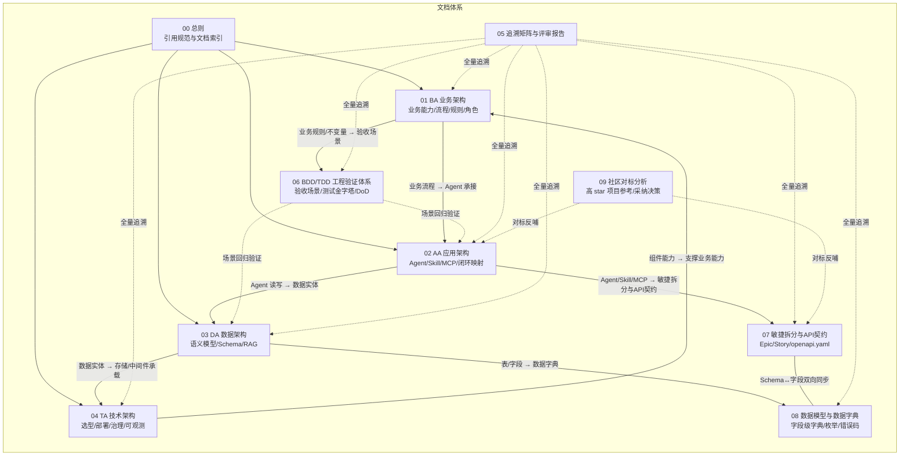

# 00 · 设计文档总则（TradeGuard 交易风控中枢）

| 文档属性 | 值 |
|---|---|
| 项目名称 | **TradeGuard · 交易风控中枢**——信用卡/支付交易反欺诈与自动化处置多 Agent 系统 |
| 参赛方向 | 方向四：金融风控与理赔自动化 |
| 文档体系版本 | v1.4（初赛方案设计阶段，含 DDD/BDD/TDD 工程验证体系、敏捷/API/数据字典交付体系、社区对标及借鉴整合） |
| 文档集 | 00 总则 / 01 BA / 02 AA / 03 DA / 04 TA / 05 追溯矩阵与评审报告 / 06 BDD-TDD 工程验证体系 / 07 敏捷拆分与 API 契约（含 openapi.yaml） / 08 数据模型与数据字典 / 09 社区对标分析 |

---

## 1. 项目一句话定义

以 **AgentTeams（原 HiClaw）** 为多 Agent 协同基点，构建覆盖
「**多源风险信号聚合 → 欺诈根因定位与影响面分析 → 风控处置建议生成与执行 → 结果核验与合规审计 → 事件复盘与知识沉淀**」
五阶段闭环的交易反欺诈风控系统（处置动作：交易拦截、账户冻结、额度调整、放行），全部高风险动作经人工审批，全部执行留痕可回溯。

对应赛题原文五个参考场景逐条命中（见 [01-业务架构 §2.2](./01-业务架构BA.md#22-赛题场景映射)）。

---

## 2. 4A 文档体系与关联关系

本设计从 **4A 架构**四个视角阐述**同一个系统**，各文档不重复定义、只交叉引用：

| 文档 | 回答的问题 | 关键产出 |
|---|---|---|
| [01 BA](./01-业务架构BA.md) | 做什么业务、为谁做、按什么规则做 | 业务能力地图、4 条端到端流程、14 条业务规则、业务 KPI |
| [02 AA](./02-应用架构AA.md) | 用什么应用形态承接业务 | 5 Agent Identity 清单、5 Skill 清单、2 MCP Server、8 项闭环映射 |
| [03 DA](./03-数据架构DA.md) | 数据怎么建模、怎么存、怎么用 | UnifiedModel 语义模型、PolarDB Schema、RAG 知识库设计 |
| [04 TA](./04-技术架构TA.md) | 用什么技术实现、怎么部署治理 | 技术选型表、部署拓扑、治理策略、可观测方案 |
| [05 评审](./05-追溯矩阵与整体评审报告.md) | 是否全部满足赛题要求 | BA→AA→DA→TA 追溯矩阵、赛题要求覆盖核对 |
| [06 BDD/TDD](./06-BDD-TDD工程验证体系.md) | 行为如何被验收、代码如何被验证 | 11 个 Given-When-Then 场景、测试金字塔、场景-规则-测试追溯矩阵、分阶段 DoD |
| [07 敏捷/API](./07-敏捷拆分与API契约.md) | 怎么拆交付、接口长什么样 | 7 Epic/29 Story、Sprint 计划、OpenAPI 3.0 契约（15 REST + 9 MCP 工具） |
| [08 数据字典](./08-数据模型与数据字典.md) | 字段级数据契约 | 13 表字段字典（12 业务表 + 1 治理辅助表）、10 类枚举、索引字典、错误码表、事件 Payload |
| [09 社区对标](./09-社区对标分析.md) | 社区同领域项目怎么做的、本方案差异在哪 | 6 类参考项目证据、已对齐/待借鉴/不采纳决策、行动项回接 07 |

---

## 3. 引用编号规范（跨文档溯源用）

所有可追溯实体使用统一编号，任何文档引用其他文档内容时必须带编号：

| 前缀 | 含义 | 定义位置 | 示例 |
|---|---|---|---|
| `BA-CAP-x` | 业务能力 | 01 §3 | BA-CAP-05 风控处置 |
| `BA-BP-x` | 业务流程 | 01 §4 | BA-BP-01 交易风控全流程 |
| `BA-BR-x` | 业务规则 | 01 §5 | BA-BR-01 自动处置边界 |
| `BA-KPI-x` | 业务指标 | 01 §7 | BA-KPI-01 事件响应时效 |
| `AA-AG-x` | Agent 身份 | 02 §3 | AA-AG-03 调查取证 Agent |
| `AA-SK-x` | Skill | 02 §4 | AA-SK-02 fraud-investigation |
| `AA-MCP-x` | MCP Server / 工具 | 02 §5 | AA-MCP-01 交易风控业务库 MCP |
| `AA-CL-x` | 闭环要素 | 02 §6 | AA-CL-07 审批与回滚 |
| `DA-N-x` / `DA-L-x` | 语义模型节点 / 关系 | 03 §3 | DA-N-03 交易 |
| `DA-T-x` | 数据库表 | 03 §4 | DA-T-04 risk_signal |
| `DA-KB-x` | 知识库集合 | 03 §5 | DA-KB-01 欺诈手法案例库 |
| `TA-C-x` | 技术组件 | 04 §2 | TA-C-01 AgentTeams |
| `DA-INV-x` | 聚合不变量 | 03 §9.3 | DA-INV-03 幂等键 |
| `SC-x` | BDD 验收场景 | 06 §2 | SC-02 高风险强制审批 |
| `US-{Epic}-{序}` | 用户故事 | 07 §3 | US-E5-03 审批写路径 |
| `API-W-x` / `API-M-x` | REST 接口 / MCP 工具 | 07 §5 | API-W-09 审批决策 |

**引用方向约束**：BA 只被引用不引用下层细节；AA 引用 BA 编号说明业务承接；DA 引用 AA 编号说明数据读写方；TA 引用 DA/AA 编号说明承载关系。全量映射见 [05 追溯矩阵](./05-追溯矩阵与整体评审报告.md)。

---

## 4. 技术版本策略（保守原则）

赛题要求"版本不冒进"。本体系执行以下版本纪律：

1. **必选组件 AgentTeams / HiClaw**：使用官方 Quick Install 脚本交付的当前稳定版，不自改框架内核（依据：hiclaw.io 官方一键安装）。
2. **所有开源组件只锁定大版本线**（如 Nacos 3.2.x、RocketMQ 5.x、Node.js ≥20），提交复赛代码时在 `docker-compose.yml` 中锁定当时最新稳定小版本并记录于变更日志。
3. **不使用** Beta/RC/预览版特性；Nacos "预览版（Next）" 文档功能一律不写入设计。
4. **每个组件均给出等价替代与迁移成本**（见 [04 §2 选型表](./04-技术架构TA.md#2-技术选型总表)），满足赛题"可替换性"评审要求。

---

## 5. 术语约定

- **交易风控术语**：以 [01 §2 术语表](./01-业务架构BA.md#2-领域术语表交易风控与反欺诈) 为准，全文档集统一使用。
- **Agent / Worker / Manager**：沿用 AgentTeams 官方术语，Manager Agent 指主控，Worker Agent 指职能执行体。
- **风险事件（Case）**：一次从告警接入到归档的完整风控处置对象（可对应一笔可疑交易、一个账户或一个关联团伙），是贯穿 4A 的核心业务对象。

---

## 6. 修订记录

| 版本 | 日期 | 说明 |
|---|---|---|
| v1.0 | 初赛阶段 | 初稿：4A 成套设计文档 + 整体评审报告 |
| v1.1 | 初赛阶段 | 注入 DDD（01 §10 战略 / 03 §9 战术）与 BDD/TDD（新增 06 文档）；业务域切换为交易风控 |
| v1.2 | 初赛阶段 | 新增 07 敏捷拆分与 OpenAPI 3.0 契约（含机读 openapi.yaml）、08 字段级数据字典；04 §10 三端真实调用链落定 |
| v1.3 | 初赛阶段 | 关联性审计修复 5 处孤岛（R-14~R-18）；新增 09 社区对标分析（AWS/GNN/多 Agent/观测/合成数据六类参考） |
| v1.4 | 初赛阶段 | 对标借鉴整合：BA-BR-14 velocity 规则 + SC-11 + DA-T-04 velocity_json 五环贯通（14 规则/11 场景/12 表/15 paths/29 Story） |
| v1.4.1 | 2026-08-13 | Sprint 0 技术体系落地：仓库骨架 + compose 全栈实测（见 05 第八轮）；实现反哺修正 04 §3 部署形态、03 §4 account 读写方（R-19/R-20） |
| v1.4.2 | 2026-08-13 | Sprint 0 架构设计落地：三端植入状态机/仓储/端口适配器/不变量双守护等架构构件，API-W-01~15 与 API-M-01~09 全量声明（见 05 第八轮补充与三端 README） |
| v1.4.3 | 2026-08-13 | 实现反哺回写：R-21（03 §9.2 事件分类声明 + 08 DA-T-13 白名单表字典，表数 12→13）/R-22（测试欠债列入 Sprint 1 首批门禁）；仓库推送 GitHub snake7740/FinancialRisk |
