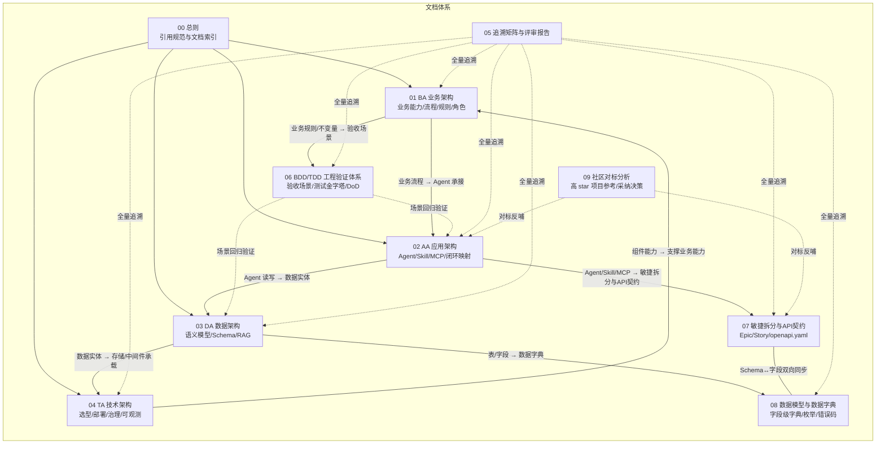

# 00 · 设计文档总则（TradeGuard 交易风控中枢）

| 文档属性 | 值 |
| --- | --- |
| 项目名称 | **TradeGuard · 交易风控中枢**——信用卡/支付交易反欺诈与自动化处置多 Agent 系统 |
| 业务领域 | 金融风控与理赔自动化（交易反欺诈与自动化处置） |
| 文档体系版本 | v1.4.20（实现落地阶段：DDD/BDD/TDD 工程验证体系 + 敏捷/API/数据字典交付体系 + 社区对标借鉴 + 全栈实现回写 + 核心技术栈连通攻坚 + 一键启动真实取证 + 文档×代码×HTML 三端一致对齐 + 表述专业化 + 深度安全加固 + 务实化提升（边界契约/AI 实质/工程韧性/风控模型/团伙发现/CI 门禁/离线评估）+ 浏览器多角色协同实测，见 §6 修订记录） |
| 文档集 | 00 总则 / 01 BA / 02 AA / 03 DA / 04 TA / 05 追溯矩阵与评审报告 / 06 BDD-TDD 工程验证体系 / 07 敏捷拆分与 API 契约（含 openapi.yaml） / 08 数据模型与数据字典 / 09 社区对标分析 |

---

## 1. 项目一句话定义

以 **AgentTeams（原 HiClaw）** 为多 Agent 协同基点，构建覆盖
「**多源风险信号聚合 → 欺诈根因定位与影响面分析 → 风控处置建议生成与执行 → 结果核验与合规审计 → 事件复盘与知识沉淀**」
五阶段闭环的交易反欺诈风控系统（处置动作：交易拦截、账户冻结、额度调整、放行），全部高风险动作经人工审批，全部执行留痕可回溯。

对应需求原文五个参考场景逐项对应（见 [01-业务架构 §2.2](./01-业务架构BA.md#22-业务场景映射)）。

---

## 2. 4A 文档体系与关联关系

本设计从 **4A 架构**四个视角阐述**同一个系统**，各文档不重复定义、只交叉引用：

| 文档 | 回答的问题 | 关键产出 |
| --- | --- | --- |
| [01 BA](./01-业务架构BA.md) | 做什么业务、为谁做、按什么规则做 | 业务能力地图、4 条端到端流程、14 条业务规则、业务 KPI |
| [02 AA](./02-应用架构AA.md) | 用什么应用形态承接业务 | 5 Agent Identity 清单、5 Skill 清单、2 MCP Server、8 项闭环映射 |
| [03 DA](./03-数据架构DA.md) | 数据怎么建模、怎么存、怎么用 | UnifiedModel 语义模型、PolarDB Schema、RAG 知识库设计 |
| [04 TA](./04-技术架构TA.md) | 用什么技术实现、怎么部署治理 | 技术选型表、部署拓扑、治理策略、可观测方案 |
| [05 评审](./05-追溯矩阵与整体评审报告.md) | 是否全部满足需求基线 | BA→AA→DA→TA 追溯矩阵、需求基线覆盖核对 |
| [06 BDD/TDD](./06-BDD-TDD工程验证体系.md) | 行为如何被验收、代码如何被验证 | 11 个 Given-When-Then 场景、测试金字塔、场景-规则-测试追溯矩阵、分阶段 DoD |
| [07 敏捷/API](./07-敏捷拆分与API契约.md) | 怎么拆交付、接口长什么样 | 7 Epic/29 Story、Sprint 计划、OpenAPI 3.0 契约（22 REST 路径 + 15 MCP 工具） |
| [08 数据字典](./08-数据模型与数据字典.md) | 字段级数据契约 | 13 表字段字典（12 业务表 + 1 治理辅助表）、10 类枚举、索引字典、错误码表、事件 Payload |
| [09 社区对标](./09-社区对标分析.md) | 社区同领域项目怎么做的、本方案差异在哪 | 6 类参考项目证据、已对齐/待借鉴/不采纳决策、行动项回接 07 |
| [skills/ 技能库](../skills/README.md) | 官方技能可执行定义 + 本机 skill 调度 | AA-SK-01~05 九属性契约与确定性步骤、SKILL-DISPATCH 调度矩阵 |

---

## 3. 引用编号规范（跨文档溯源用）

所有可追溯实体使用统一编号，任何文档引用其他文档内容时必须带编号：

| 前缀 | 含义 | 定义位置 | 示例 |
| --- | --- | --- | --- |
| `BA-CAP-x` | 业务能力 | 01 §3 | BA-CAP-05 风控处置 |
| `BA-BP-x` | 业务流程 | 01 §4 | BA-BP-01 交易风控全流程 |
| `BA-BR-x` | 业务规则 | 01 §5 | BA-BR-01 自动处置边界 |
| `BA-KPI-x` | 业务指标 | 01 §7 | BA-KPI-01 事件响应时效 |
| `AA-AG-x` | Agent 身份 | 02 §3 | AA-AG-03 调查取证 Agent |
| `AA-SK-x` | Skill | 02 §4 | AA-SK-02 fraud-investigation |
| `AA-MCP-x` | MCP Server / 工具 | 02 §5 | AA-MCP-01 交易风控业务库 MCP |
| `AA-CL-x` | 闭环要素 | 02 §6 | AA-CL-07 审批与回滚 |
| `DA-N-x` / `DA-L-x` | 语义模型节点 / 关系 | 03 §3 | DA-N-03 交易 |
| `DA-T-x` | 数据库表 | 03 §4 | DA-T-04 risk_signal |
| `DA-KB-x` | 知识库集合 | 03 §5 | DA-KB-01 欺诈手法案例库 |
| `TA-C-x` | 技术组件 | 04 §2 | TA-C-01 AgentTeams |
| `DA-INV-x` | 聚合不变量 | 03 §9.3 | DA-INV-03 幂等键 |
| `SC-x` | BDD 验收场景 | 06 §2 | SC-02 高风险强制审批 |
| `US-{Epic}-{序}` | 用户故事 | 07 §3 | US-E5-03 审批写路径 |
| `API-W-x` / `API-M-x` | REST 接口 / MCP 工具 | 07 §5 | API-W-09 审批决策 |

**引用方向约束**：BA 只被引用不引用下层细节；AA 引用 BA 编号说明业务承接；DA 引用 AA 编号说明数据读写方；TA 引用 DA/AA 编号说明承载关系。全量映射见 [05 追溯矩阵](./05-追溯矩阵与整体评审报告.md)。

---

## 4. 技术版本策略（保守原则）

技术选型遵循"版本不冒进"原则。本体系执行以下版本纪律：

1. **核心基座组件 AgentTeams / HiClaw**：使用官方 Quick Install 脚本交付的当前稳定版，不自改框架内核（依据：hiclaw.io 官方一键安装）。
2. **所有开源组件只锁定大版本线**（如 Nacos 3.2.x、RocketMQ 5.x、Node.js ≥20），交付提交时在 `docker-compose.yml` 中锁定当时最新稳定小版本并记录于变更日志。
3. **不使用** Beta/RC/预览版特性；Nacos "预览版（Next）" 文档功能一律不写入设计。
4. **每个组件均给出等价替代与迁移成本**（见 [04 §2 选型表](./04-技术架构TA.md#2-技术选型总表)），满足"可替换性"质量要求。

---

## 5. 术语约定

- **交易风控术语**：以 [01 §2 术语表](./01-业务架构BA.md#2-领域术语表交易风控与反欺诈) 为准，全文档集统一使用。
- **Agent / Worker / Manager**：沿用 AgentTeams 官方术语，Manager Agent 指主控，Worker Agent 指职能执行体。
- **风险事件（Case）**：一次从告警接入到归档的完整风控处置对象（可对应一笔可疑交易、一个账户或一个关联团伙），是贯穿 4A 的核心业务对象。

---

## 6. 修订记录

| 版本 | 日期 | 说明 |
| --- | --- | --- |
| v1.0 | 设计阶段 | 初稿：4A 成套设计文档 + 整体评审报告 |
| v1.1 | 设计阶段 | 注入 DDD（01 §10 战略 / 03 §9 战术）与 BDD/TDD（新增 06 文档）；业务域切换为交易风控 |
| v1.2 | 设计阶段 | 新增 07 敏捷拆分与 OpenAPI 3.0 契约（含机读 openapi.yaml）、08 字段级数据字典；04 §10 三端真实调用链落定 |
| v1.3 | 设计阶段 | 关联性审计修复 5 处孤岛（R-14~R-18）；新增 09 社区对标分析（AWS/GNN/多 Agent/观测/合成数据六类参考） |
| v1.4 | 设计阶段 | 对标借鉴整合：BA-BR-14 velocity 规则 + SC-11 + DA-T-04 velocity_json 五环贯通（14 规则/11 场景/12 表/15 paths/29 Story） |
| v1.4.1 | 2026-08-13 | Sprint 0 技术体系落地：仓库骨架 + compose 全栈实测（见 05 第八轮）；实现反哺修正 04 §3 部署形态、03 §4 account 读写方（R-19/R-20） |
| v1.4.2 | 2026-08-13 | Sprint 0 架构设计落地：三端植入状态机/仓储/端口适配器/不变量双守护等架构构件，API-W-01~15 与 API-M-01~09 全量声明（见 05 第八轮补充与三端 README） |
| v1.4.3 | 2026-08-13 | 实现反哺回写：R-21（03 §9.2 事件分类声明 + 08 DA-T-13 白名单表字典，表数 12→13）/R-22（测试欠债列入 Sprint 1 首批门禁）；仓库推送 GitHub snake7740/TradeGuard |
| v1.4.4 | 2026-08-14 | Sprint 1-8 全量落地 + 第九轮闭环复核（R-23~R-28）：事件驱动闭环接通（EventWorker + RocketMQ 实测连通）、状态机 21 迁移（DispositionFailed/RollbackEscalated）、mcp-core 处置准入加固（approval_ref 验真含逆动作对）、SC-06 阈值真接线、DB actor 守卫、契约对齐（API-W-21/22 + API-M-14/15 + openapi 22 路径 + demo_playbook 3/3）；测试 169 例全绿，KPI 按全量/演示范围分列重生成；04 §5 Higress 落地实况如实声明（旁路直连） |
| v1.4.5 | 2026-08-14 | Sprint 9 + 第十轮复核（R-29~R-31）：前端展示文案全量对齐金融风控行业术语（案件/审批单/知识条目/处置记录）、Skills Registry 元数据与代码同源（AA-SK-05 kernel 修正）、可观测 OTLP 数据流接通（tracing.py 直推 AgentScope Studio，按 v1.0.9 源码实证混合字段语义适配，按案件分组落库技能 span） |
| v1.4.6 | 2026-08-14 | Sprint 10 + 第十一轮攻坚（R-32）：Higress 网关真实承载门户业务流量——端口修正（8180→8080）、文件仓下发 McpBridge（dns 型服务源 + *.tg.local 别名）+ Ingress /api、nginx 上游切换 higress:8080（envoy 计数取证）、scripts/higress_routes.py 幂等重建入库；web-api→MCP 保留直连为场景化取舍并如实声明（04 §5 改写） |
| v1.4.7 | 2026-08-14 | Sprint 11 + 第十二轮攻坚（R-33）：AgentTeams 协同执行真接线——controller/4 Worker 运行态复原（qwen3.8-max）、tradeguard-net 组网复原、4 Worker 经 mcporter 工具桥注入 tg-core(12)/tg-external(3) MCP Server 并实测调用返回真实库数据、04 §4 协同映射扩为五维协同→框架能力对照表（附实测证据 + 集成深度如实声明）、scripts/agentteams_doctor.py 幂等体检恢复入库 |
| v1.4.8 | 2026-08-14 | Sprint 12 + 第十三轮自证（R-34）：一键启动 + 真实数据通路验证——新增 scripts/start_all.py（引擎预检自动拉起 Docker Desktop→down 保卷→逐端口清障→up→真实探活→数据就位→Higress 重建→AgentTeams 体检→C1~C9+X1 端到端硬证据），实测首跑暴露 2 真问题（Docker 引擎进程 com.docker.backend.exe 系宿主端口监听者不可 taskkill、冒烟立案 source_type 契约枚举外被 422 拒收）并修复固化，复跑 20/20 全绿 exit 0（真实立案→EventWorker 自动 DISPOSED→审计/凭证/span 落库取证），系统可用性由真实启动取证而非仅停留在纸面陈述 |
| v1.4.9 | 2026-08-15 | Sprint 13 + 第十四轮三端一致对齐（R-35）：文档×代码×展示 HTML 约 130 条陈述逐项反向核实，约 30 处失配以最齐全一端为准补齐——v_graph_edge 补第四类边 SAME_CONTACT（运行库执行 + 团伙 contact_hash 回填，四类边全实证）、BR-06 加分纳入 SC-06 热更新（br-06-fraud-link-bonus 三处同源）、nacos_register AA-MCP-01 工具元数据改在码 12 工具全集；前端全页面 SSE 成立 + API-W-16/W-22 获门户可视化消费方 + 角色切换入顶栏；展示 HTML 约 20 处不实陈述修正并修复翻页 bug；01 §2.2 阶段字母与 AA-SK-04 三分支回写。取证：pytest 169/169 全绿（期间修复 BR-06 basis 串漂移破坏 API-M-13 幂等标记 1 处回归）、npm run build 通过、demo_playbook 3/3（24 步校验） |
| v1.4.10 | 2026-08-16 | Sprint 13 补充 + 第十五轮表述专业化（R-36）：全仓外部活动相关直白字样全量语义替换为工程与业务术语——需求基线/需求原文（来源类）、设计阶段/实现 M1~M3/验收（阶段类）、核心基座/核心技术栈/架构基点（强制类）、评审对象类字样移除或转客观表述，24 文件 120+ 处，语义与证据不变；变更标题的锚点跨文档链接同步更新（01 §2.2、02 §3/§4/§6、03 §5.3、04 §4.1、05 §2）；kpi_report.py 输出与 kpi-report.md 同源 |
| v1.4.11 | 2026-08-16 | Sprint 13 补充 + 第十六轮深度安全审计与全量加固（R-37）：六领域并行审计发现九类问题并全量修复——明文凭据全量清除（.env 唯一凭据源 + .env.example 模板 + start_all 凭证自举 + compose ${VAR:?} fail-fast）；TG_API_TOKEN bearer 守卫全量 /api（SSE 纳入鉴权、恒定时间比较、拒绝落审计，门户 nginx 自动注入）；全部宿主端口 127.0.0.1 绑定；CVE 修复（mcp 1.29.0 修 CVE-2025-66416、pydantic 2.13.4、uvicorn 0.34.3、nginx:1.31-alpine 修 CVE-2026-42945）；输入验证加固（approval_ref NULL 失败关闭、处置金额/加分/信号结构校验、operator 长度、config 键名白名单、CORS 白名单）；脚本注入面加固（端口数字校验/分区名白名单/租户端点移除/nacos 凭据失败关闭）；db/export 卷导出入库 + 空库自动恢复（克隆即完整启动，密钥扫描闸门）；测试装配竞态清零（_reviewable_case 直插法）。取证：pytest 169/169 全绿（compose 全栈并行）、start_all 核心通路 19 项全绿、npm run build 通过、demo_playbook 3/3 |
| v1.4.12 | 2026-08-16 | Sprint 13 补充 + 第十七轮三端一致性复校（R-38）：修正状态机事件数——CLAUDE.md、04 §10.1、展示 HTML §14 三处「19 事件」→「18 事件」（对齐代码 CaseEvent 枚举 18 个迁移事件与 03 §9.2 权威定义「18 迁移事件 / 21 事件名」）；统一 start_all 全绿项数——展示 HTML 五处「20/20」+ 两处「20 项」→「21/21」（对齐脚本动态计数：完整 21 项、核心 19 项，与 security-audit §3「21/21」一致，核心项数不变）；清理 docs/07 悬空引用 US-E4-05 → US-E5-04（复核确认自动建单属中风险转人工复核范畴） |
| v1.4.13 | 2026-08-16 | Sprint 14 + 第十八轮边界契约固化（R-39）：新增 app/core/ports.py（DispositionExecutor/ExternalDataSource 两 Protocol 端口，契约要求写入 docstring）+ schemas.py TransactionEvent（上游交易事件契约，L1 实时决策输入）+ test_ports.py 契约测试（6 例），将「可替换性」从文档承诺固化为代码契约，方法名对齐现有 Adapter 零改动 |
| v1.4.14 | 2026-08-16 | Sprint 14 + 第十九轮 AI 实质（R-40）：新增 EmbeddingProvider / HypothesisRanker 两 Protocol 端口 + llm_adapters.py（HashEmbeddingProvider / RuleHypothesisRanker baseline + LlmClient / DashScopeEmbeddingProvider / LlmHypothesisRanker LLM 版），无 Key 降级 baseline、人机边界不变；契约测试 13 例 |
| v1.4.14 补充 | 2026-08-16 | R-40 LLM 端到端实测修复：LlmClient 凭据改从 secrets/dashscope.env 加载 + endpoint 改用 OpenAI 兼容（/compatible-mode/v1），实测 text-embedding-v3 1024 维 + qwen3.8-max 假设排序 HTTP 200 |
| v1.4.15 | 2026-08-16 | Sprint 14 + 第二十轮工程韧性（R-41）：信号落库幂等化（确定性 signal_id + ON CONFLICT）+ EventWorker 有限重试（3 次线性退避）+ McpToolClient 连接复用 |
| v1.4.16 | 2026-08-16 | Sprint 14 + 第二十一轮风控模型抽象（R-42）：RiskScorer 端口 + RuleRiskScorer baseline + AggregationService 接线，评分模型可替换（GBDT/图特征） |
| v1.4.17 | 2026-08-16 | Sprint 14 + 第二十二轮团伙发现（R-43）：fn_fraud_ring 弱连通分量 SQL 函数 + investigation.py 团伙发现接线 |
| v1.4.18 | 2026-08-16 | Sprint 14 + 第二十三轮可交付底线（R-44）：CI workflow（gitleaks 密钥扫描 + 契约测试/纯单元 + 前端构建）+ gitleaks 配置 |
| v1.4.19 | 2026-08-16 | Sprint 14 + 第二十四轮离线评估（R-45）：offline_eval.py 混淆矩阵 + P/R/F1 + 按月漂移监控 |
| v1.4.19 补充 | 2026-08-16 | 起栈端到端实测：fn_fraud_ring 改物化表 mv_graph_edge（60s→0.4s）+ offline_eval 混淆矩阵（recall=1.0/precision=0.451）+ 语义 RAG text-embedding-v3 区分度 0.837/0.592 |
| v1.4.19 补充二 | 2026-08-16 | 语义 RAG 完整链路闭合：compose env_file 注入 LLM 凭据 + rebuild web-api；容器内实测知识入库→DashScope embedding→pgvector 存储→检索相似度 0.844（对照哈希检索为空） |
| v1.4.19 补充三 | 2026-08-16 | McpToolClient 连接复用回滚（streamable-http read_stream 消费 bug）+ 端到端闭环验证（立案 3s 自动 DISPOSED） |
| v1.4.20 | 2026-08-17 | Sprint 15 + 第二十五轮浏览器多角色协同实测（R-46）：四轮真实浏览器多角色（风控值班/复核/审批/合规审计）操作实测 + 用户手测暴露 5 缺陷并根因修复——演示主体 severity 过滤（API-W-21，high 限定 black/block 名单主体）、案件详情抽屉 SSE 自动刷新、Trace 查询案号格式校验、契约外 404 统一错误信封（E-NOT-FOUND + 正确契约路径指引）、契约 CaseId pattern 修正；BUG 台账入库 docs/reports/bug-ledger-20260817.md（分类/根因/修复状态 + 误报澄清 3 条 + 待决策 1 项） |
