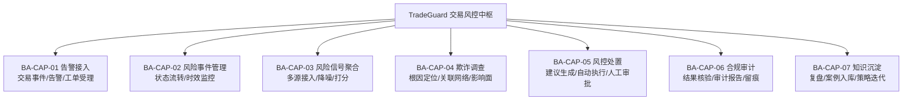
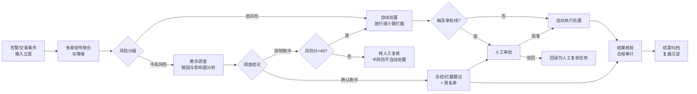
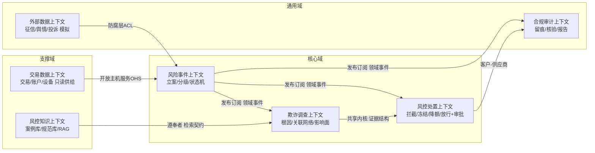

# 01 · 业务架构（BA）——信用卡/支付交易反欺诈与自动化处置

> 本文档是 TradeGuard 的业务视角阐述。文中编号（BA-xxx）被 [02 AA](./02-应用架构AA.md)、[03 DA](./03-数据架构DA.md)、[04 TA](./04-技术架构TA.md) 引用，编号规范见 [00 总则 §3](./00-总则.md#3-引用编号规范跨文档溯源用)。

---

## 1. 业务定位与价值主张

**领域**：发卡机构/支付机构的交易反欺诈风控（属金融风控中"交易欺诈风险"子类，监管依据为《银行卡业务管理办法》、反电信网络诈骗相关法规及国家金融监督管理总局对银行业金融机构欺诈风险治理的要求）。

**业务痛点**：

1. 欺诈手法团伙化、工业化（测卡攻击、账户盗用、跑分洗钱），单交易视角的决策引擎无法发现**跨账户关联**；
2. 多源信号（交易流水、征信、舆情、投诉）分散在不同系统，风控值班员人工归集耗时，错过黄金处置窗口；
3. 低风险告警量大导致告警疲劳，高风险处置又缺乏统一审批与留痕。

**价值主张**：以多 Agent 协同替代"人工告警流水线"，实现低风险事件自动处置、高风险事件证据化调查、全部处置动作合规留痕，将告警响应时效从小时级压缩到分钟级。

---

## 2. 领域术语表（交易风控与反欺诈）

| 术语 | 定义 |
|---|---|
| 持卡人 / 账户 | 银行卡申领人及其关联的账户主体 |
| 交易（Transaction） | 一次资金变动事件，含授权、清算、退款等阶段 |
| 无卡交易（CNP） | 线上无实体卡交易，欺诈高发渠道 |
| 收单 / 商户类别码（MCC） | 受理交易的商户侧及其行业分类编码 |
| 测卡攻击（Card Testing） | 用批量小额交易试探盗取卡号的有效性 |
| 账户盗用（ATO） | 攻击者接管合法账户后发起欺诈交易 |
| 套现 / 跑分 | 利用虚假交易或出借账户转移非法资金 |
| 设备指纹 | 终端设备的稳定标识聚合（硬件特征、环境特征） |
| 拦截（Decline） | 拒绝交易授权，是最轻的处置动作 |
| 冻结 / 解冻 | 暂停 / 恢复账户全部或部分交易能力 |
| 降额 / 提额 | 调低 / 调高账户信用额度 |
| 放行 | 经核实为误报后恢复交易或账户状态 |
| 争议/拒付（Chargeback） | 持卡人对交易提出异议引发的资金追索流程；本方案中其前置信号（持卡人否认交易）由投诉记录源接入（BA-BP-02） |
| 黑名单 / 灰名单 / 观察名单 | 已确认欺诈主体 / 嫌疑待核主体 / 轻度异常关注主体 |
| 风险信号 | 指示潜在欺诈的可观测数据点（异常时段、异地登录、高频小额等） |
| 降噪 | 剔除重复、低置信、无业务含义的信号，避免告警疲劳 |
| 影响面 | 一起欺诈事件波及的关联账户、关联设备、预估涉案金额范围 |
| 误报率 / 召回率 | 正常交易被误拦比例 / 欺诈交易被识别比例 |
| 留痕 | 关键处置动作的记录与存档，满足合规审计要求 |

### 2.2 赛题场景映射

| 赛题参考场景（原文） | TradeGuard 承接能力 |
|---|---|
| 多源风险信号聚合与降噪（交易流水、征信数据、舆情、投诉记录） | BA-CAP-03 / BA-BP-02 |
| 自动风险/欺诈根因定位与影响面分析 | BA-CAP-04 / BA-BP-03 |
| 理赔或授信处置建议生成与自动执行 | BA-CAP-05 / BA-BP-01 阶段 D（本方案取"授信处置"语义：拦截/冻结/额度调整） |
| 处置结果核验与合规审计确认 | BA-CAP-06 / BA-BP-01 阶段 E |
| 风险事件复盘与风控知识库沉淀 | BA-CAP-07 / BA-BP-04 |

---

## 3. 业务能力地图

---

## 4. 端到端业务流程

### 4.1 BA-BP-01 交易风控全流程（主流程）

流程阶段定义（后续文档均以阶段字母引用）：

| 阶段 | 名称 | 关键动作 | 对应赛题闭环要素 |
|---|---|---|---|
| A | 告警接入 | 接收风控引擎告警、欺诈工单、交易异常事件，生成风险事件 | 任务输入 |
| B | 信号聚合 | 聚合交易流水/征信/舆情/投诉信号并降噪 | 任务拆解、工具调用 |
| C | 风险分级 | 规则+模型综合评分，分低/中/高三档 | 任务拆解 |
| D | 调查/处置 | 高风险走调查，低风险走自动处置，中风险（40–69）转人工复核 | 上下文传递、工具调用 |
| G-I | 处置审批 | 触及审批线则人工审批，支持驳回回滚 | 审批与回滚 |
| H | 处置执行 | 调用拦截/冻结/降额/放行接口 | 工具调用 |
| K | 核验审计 | 核验处置结果，生成审计报告 | 结果验证、证据沉淀 |
| L | 归档沉淀 | 复盘入库 | 经验沉淀 |

### 4.2 BA-BP-02 多源风险信号聚合与降噪

1. 信号源接入（四类，与赛题点名的数据源一一对应）：
   - **交易流水**（第一方数据，机构自有）：金额、时段、MCC、渠道、地理位置、设备指纹；
   - **征信数据**（模拟接口）：主体信用评分、逾期标记——生产环境须经持牌征信机构授权接入，本方案以模拟服务替代并在方案中声明（见 §8 数据合规声明）；
   - **舆情**（模拟源）：涉诈主体网络曝光信息；
   - **投诉记录**（客服工单）：持卡人否认交易、商户投诉。
2. 标准化：各源信号映射为统一信号结构（字段定义见 [03 §4 DA-T-04](./03-数据架构DA.md#4-polardb-逻辑模型)）；
3. 降噪：同一主体 24h 内重复信号合并；置信度低于 0.3 的信号仅存档不告警；
4. 评分：按信号类型权重加权输出事件风险分（0–100）。

### 4.3 BA-BP-03 欺诈根因定位与影响面分析

1. 根因假设生成：基于信号组合匹配已知欺诈手法（测卡、ATO、跑分等，检索知识库 DA-KB-01）；
2. 关联网络扩展：以事件主体为起点，按"同设备指纹 / 同收款账户 / 同 IP 段 / 同联系方式"四类边做 2 跳扩展（语义模型见 [03 §3](./03-数据架构DA.md#3-unifiedmodel-语义模型)）；
3. 影响面输出：关联账户清单、关联事件清单、预估涉案金额；
4. 证据链固化：每条结论附数据来源与置信度，写入事件证据表（DA-T-05）。

### 4.4 BA-BP-04 事件复盘与知识沉淀

1. 结案后自动生成复盘摘要：风险分演变、命中规则、调查路径、处置结论；
2. 确认为新欺诈手法的事件，经人工确认后入库 DA-KB-01；
3. 策略有效性统计：误报率高的规则自动标记，提交策略迭代建议。

---

## 5. 业务规则表

| 编号 | 规则 | 默认值 | 配置位置 |
|---|---|---|---|
| BA-BR-01 | 自动处置边界：单笔涉案 <5,000 元且风险分 <40 可自动执行拦截/放行；风险分 40–69（中风险）一律转人工复核，不得自动处置 | 5,000 元 | Nacos 动态配置（TA-C-05） |
| BA-BR-02 | 风险分 ≥70 一律进入人工审批，无论金额 | 70 分 | Nacos 动态配置 |
| BA-BR-03 | 账户冻结必须附书面理由与证据链，缺一不可 | 强制 | 硬编码校验 |
| BA-BR-04 | 黑名单主体新交易，自动拦截并升级高风险 | 强制 | 硬编码 |
| BA-BR-05 | 同一账户 7 天内触发 ≥3 次风险事件，自动增加"高频异常"信号 | 3 次 | Nacos 动态配置 |
| BA-BR-06 | 关联网络 2 跳内存在已确认欺诈主体，事件风险分 +30 | +30 | Nacos 动态配置 |
| BA-BR-07 | 审批驳回的事件回滚为人工复核任务，禁止再次进入自动通道 | 强制 | 硬编码 |
| BA-BR-08 | 处置执行后 10 分钟内必须完成核验，超时告警 | 10 分钟 | Nacos 动态配置 |
| BA-BR-09 | 所有处置动作必须落审计日志，含操作者（Agent 或人）与依据 | 强制 | 硬编码 |
| BA-BR-10 | 征信/舆情查询须记录查询事由，满足个人信息保护合规 | 强制 | 硬编码 |
| BA-BR-11 | 知识入库必须经人工确认，Agent 不得直接发布策略 | 强制 | 审批门控 |
| BA-BR-12 | 事件与交易数据保留 5 年，超期脱敏归档 | 5 年 | 数据生命周期策略 |
| BA-BR-13 | 高风险事件审批时效 30 分钟，超时自动提醒值班房间并升级值班员 | 30 分钟 | Nacos 动态配置 |
| BA-BR-14 | 风险信号必须携带频次统计特征 velocity_1h / velocity_24h（近 1/24 小时交易笔数与金额），由聚合阶段计算填充并参与风险评分（对标社区反欺诈 velocity 特征实践，见 [09](./09-社区对标分析.md)） | 强制 | Nacos 动态配置（阈值） |

---

## 6. 业务角色与职责

| 角色 | 职责 | 与系统的交互 |
|---|---|---|
| 风控值班员 | 处理回滚/疑难事件的人工复核 | 事件工作台 |
| 风控审批官 | 冻结账户、大额拦截的最终审批 | Matrix 房间 + 审批门户 |
| 合规审计员 | 审阅审计报告、抽检处置留痕 | 审计报告查询 |
| 风控策略管理员 | 维护阈值配置、确认知识入库 | Nacos 控制台 + 知识库后台 |

人机边界原则：**Agent 可建议、可执行低风险动作；账户冻结与高金额处置必须由人最终确认**（落实赛题"审批与回滚"要求，对应 AA-CL-07）。

---

## 7. 业务指标（KPI）

| 编号 | 指标 | 定义 | 目标 |
|---|---|---|---|
| BA-KPI-01 | 事件响应时效 | 告警接入到处置完成的平均时长 | 低风险事件 ≤5 分钟 |
| BA-KPI-02 | 欺诈识别召回率 | 确认欺诈事件中被系统标记的比例 | ≥85%（演示数据集） |
| BA-KPI-03 | 误报率 | 正常交易被误标高风险的比例 | ≤10% |
| BA-KPI-04 | 人工介入率 | 需人工审批/复核的事件占比 | ≤30% |
| BA-KPI-05 | 处置留痕完整率 | 有完整审计链的处置动作占比 | 100% |

指标数据由可观测体系产出（见 [04 §7](./04-技术架构TA.md#7-可观测体系)），评估口径见 05 评审报告。

---

## 8. 数据可得性与合规声明（针对个人信息边界）

本节正面回答"多源数据从哪来、是否合规"：

| 数据源 | 可得性定性 | 本方案处理 |
|---|---|---|
| 交易流水 | **第一方数据**：发卡/支付机构自身产生，全量合法持有 | 直接使用，作为信号聚合主数据源 |
| 设备指纹/IP/MCC | 交易报文自带字段 | 直接使用 |
| 征信数据 | 外部数据，生产环境须持牌征信机构授权 | **模拟征信服务**（输出评分+逾期标记），文档声明生产替换路径（见 AA-MCP-02） |
| 舆情 | 公开信息 | 模拟舆情源，仅用于演示信号接入链路 |
| 投诉记录 | 机构客服系统第一方数据 | 模拟客服工单数据 |

合规设计要点（写入 [03 DA](./03-数据架构DA.md) 与 [04 TA](./04-技术架构TA.md)）：

1. 所有个人身份信息（姓名、证件号、卡号）**落库即脱敏**（卡号仅存后四位+哈希）；
2. Agent 查询个人信息必须携带查询事由（BA-BR-10），事由写入审计表；
3. 演示数据集全部为合成数据，不含任何真实个人信息。

---

## 9. 向下游架构的交接声明

- 每条 BA-BP 流程节点**有且仅有一个** Agent 承接，映射见 [02 §3.6](./02-应用架构AA.md#36-agent-与业务流程承接矩阵)；
- 所有阈值型规则（BA-BR-01/02/05/06/08）必须支持运行时热更新，数据架构须在配置数据域体现（DA-T-11）；
- 所有留痕要求（BA-BR-09/10）在数据架构中对应不可更新的 append-only 审计表（DA-T-08）。

---

## 10. DDD 战略设计（限界上下文与上下文映射）

本文档 §2 术语表即 DDD 意义上的**统一语言（Ubiquitous Language）**：业务、产品、开发、文档一律使用同一套术语，禁止同义异名（如"拦截/拒付"混用）。

### 10.1 限界上下文划分

| 上下文 | 类型 | 对应构件 | 统一语言要点 |
|---|---|---|---|
| 交易数据上下文 | 支撑域 | DA-T-01/02、AA-MCP-01 只读工具 | 交易/账户/设备指纹；对风控只读，防上下文侵入 |
| 风险事件上下文 | **核心域** | DA-T-03/04、AA-AG-01/02 | 风险事件/风险信号/风险分；聚合根=风险事件 |
| 欺诈调查上下文 | **核心域** | DA-T-05、AA-AG-03、DA §3 语义模型 | 根因假设/证据链/影响面 |
| 风控处置上下文 | **核心域** | DA-T-06/07、AA-AG-04 | 处置动作/幂等键/审批凭证 |
| 风控知识上下文 | 支撑域 | DA-KB-01/02、AA-SK-05 | 手法库/入库申请/发布 |
| 合规审计上下文 | 通用域 | DA-T-08、AA-AG-05 | 审计链/核验/报告 |
| 外部数据上下文 | 通用域 | AA-MCP-02 | 模拟源/生产替换路径 |

### 10.2 上下文映射关系说明（与赛题闭环的对应）

| 映射模式 | 落点 | 闭环价值 |
|---|---|---|
| 发布-订阅（领域事件） | 风险事件上下文经 RocketMQ（TA-C-06）发布领域事件，调查/处置/审计上下文订阅（事件目录见 [03 §9.2](./03-数据架构DA.md#92-领域事件目录)） | AA-CL-01/02 任务输入与拆解的解耦载体 |
| 防腐层 ACL | AA-MCP-02 将模拟征信/舆情/投诉的异构输出统一翻译为标准信号结构（DA-T-04） | 生产替换真实数据源时核心域零改动（赛题"迁移成本"要求） |
| 开放主机服务 OHS | AA-MCP-01 对外暴露统一 Schema 工具集，任何上下文按契约调用 | AA-CL-04 工具调用稳定性 |
| 客户-供应商 | 处置上下文（客户）向审计上下文（供应商）提交执行凭证请求核验 | AA-CL-05 结果验证 |
| 共享内核 | 证据结构（claim/source_ref/confidence）在调查与处置上下文间同构 | 冻结/拦截理由与证据链一致性（BA-BR-03） |

### 10.3 战略设计约束

1. **核心域投入优先**：复赛开发资源优先保障风险事件/调查/处置三上下文的最小闭环（与 [06 §5](./06-BDD-TDD工程验证体系.md#5-tdd-实施纪律与分阶段-dod) 里程碑对齐）；
2. **上下文间禁止直接读写对方存储**：一律经领域事件或 MCP 契约（违反即破坏权限边界，与 [03 §6](./03-数据架构DA.md#6-agent-数据读写矩阵) 双重约束）；
3. **统一语言治理**：新增术语必须先入 §2 术语表再进入任何文档/代码（代码标识符用英文对应词，如 RiskCase/Disposition）。
