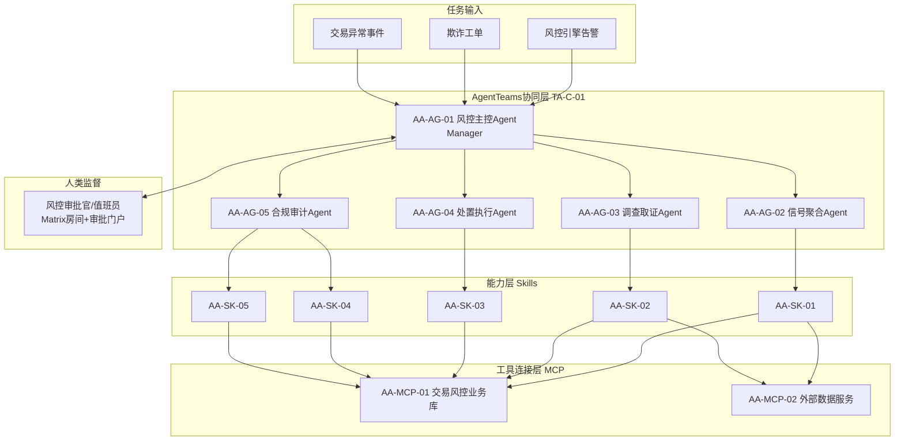
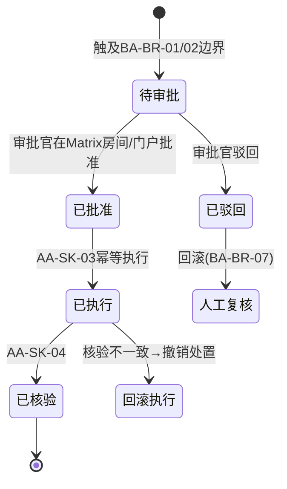

# 02 · 应用架构（AA）——多 Agent 协同应用设计

> 本文档是 TradeGuard 的应用视角阐述：业务架构 [01 BA](./01-业务架构BA.md) 定义的流程与规则，在本文档落为 Agent、Skill、MCP 三类应用构件。编号规范见 [00 总则 §3](./00-总则.md#3-引用编号规范跨文档溯源用)。

---

## 1. 应用总体视图

**与 AgentTeams 的结构映射**（赛题必选项）：

| AgentTeams 框架能力 | TradeGuard 映射 |
|---|---|
| Manager Agent 任务拆解与调度 | AA-AG-01 接收告警后拆解为聚合→调查→处置→审计子任务 |
| Worker Agent 职能执行 | AA-AG-02～05，一职能一 Worker |
| Matrix 房间协作 | 每个风险事件一个房间，房间消息=上下文传递载体（AA-CL-03） |
| 人类实时介入 | 审批官进入房间观察/发言干预；审批动作走 AA-CL-07 |
| Worker 不持真实密钥 | 所有外部凭据由 Higress 凭据透传（TA-C-04），Worker 仅持 consumer token |
| 状态追踪 | 事件状态机经 RocketMQ 事件流转（TA-C-06），房间历史+审计表双留痕 |

---

## 3. Agent Identity 清单（赛题附录 A 字段）

5 个 Agent，超过赛题"至少 3 个"要求。

### 3.1 AA-AG-01 风控主控 Agent（Manager）

| 字段 | 内容 |
|---|---|
| 身份定义 | TradeGuard 值班主管，负责告警受理、任务拆解与全流程状态追踪 |
| 职能边界 | 只做编排与裁决，不直接调用业务工具、不做定性结论 |
| 输入 | 告警/工单/交易事件（BA-BP-01 阶段 A） |
| 输出 | 子任务分派、阶段流转指令、最终结案摘要 |
| 工具/Skill | 仅事件状态读写（AA-MCP-01 受限工具集） |
| 上下文职责 | 维护事件共享状态（DA-T-03），确保每个 Worker 拿到完整前序结论 |
| 失败处理 | Worker 超时 3 次重试失败→降级为人工任务并告警，响应时效纳入 BA-KPI-01 监控 |
| 安全边界 | 无处置执行权限 |

### 3.2 AA-AG-02 信号聚合 Agent（Worker）

| 字段 | 内容 |
|---|---|
| 身份定义 | 多源信号采集与降噪专员 |
| 职能边界 | 只聚合与评分，不下欺诈结论 |
| 输入 | 事件主体标识（账户/卡哈希/设备指纹） |
| 输出 | 标准化信号清单 + 事件风险分（0–100） |
| 工具/Skill | AA-SK-01 → AA-MCP-01（交易流水）、AA-MCP-02（征信/舆情/投诉） |
| 失败处理 | 单数据源超时→该源信号置空并标记"数据源降级"，不阻塞主流程 |
| 安全边界 | 查询个人信息必须携带查询事由（BA-BR-10） |

### 3.3 AA-AG-03 调查取证 Agent（Worker）

| 字段 | 内容 |
|---|---|
| 身份定义 | 欺诈调查员，负责根因定位与影响面分析 |
| 职能边界 | 输出"欺诈假设+证据链+置信度"，**确认欺诈的定性须人工审批**（人机边界，01 §6） |
| 输入 | 风险分与信号清单（AA-AG-02 输出） |
| 输出 | 根因假设、关联网络图谱、影响面报告、证据链 |
| 工具/Skill | AA-SK-02 → AA-MCP-01（关联网络查询）、DA-KB-01 案例检索 |
| 失败处理 | 关联查询超时→输出已知 1 跳结果并注明深度受限 |
| 安全边界 | 只读权限；不得修改账户状态 |

### 3.4 AA-AG-04 处置执行 Agent（Worker）

| 字段 | 内容 |
|---|---|
| 身份定义 | 风控处置执行员 |
| 职能边界 | 生成处置建议并执行；**超 BA-BR-01 边界或风险分 ≥BA-BR-02 一律提交人工审批** |
| 输入 | 风险分（低风险事件）或调查结论（高风险事件） |
| 输出 | 处置动作执行结果（拦截/冻结/降额/放行）+ 执行凭证 |
| 工具/Skill | AA-SK-03 → AA-MCP-01（处置接口，幂等） |
| 失败处理 | 执行失败→状态回退"待处置"，重试 2 次后转人工；驳回→回滚人工复核（BA-BR-07） |
| 安全边界 | 处置幂等键防重复执行；金额/账户级操作必须引用审批凭证编号 |

### 3.5 AA-AG-05 合规审计 Agent（Worker）

| 字段 | 内容 |
|---|---|
| 身份定义 | 合规审计员 + 知识管理员 |
| 职能边界 | 事后核验处置结果、生成审计报告、组织复盘入库（入库须人工确认，BA-BR-11） |
| 输入 | 处置执行凭证 + 全事件上下文 |
| 输出 | 审计报告（DA-T-08）、复盘摘要、知识入库申请单 |
| 工具/Skill | AA-SK-04（核验）、AA-SK-05（沉淀）→ AA-MCP-01 |
| 失败处理 | 核验发现处置结果与预期不符→立即升级告警并冻结后续自动动作 |
| 安全边界 | 审计表 append-only；知识库只可提交申请，不可直接发布 |

### 3.6 Agent 与业务流程承接矩阵

| BA 流程阶段 | 承接 Agent | 使用 Skill |
|---|---|---|
| BA-BP-01 A（告警接入） | AA-AG-01 | — |
| BA-BP-01 B / BA-BP-02（信号聚合） | AA-AG-02 | AA-SK-01 |
| BA-BP-01 C（风险分级） | AA-AG-01（依 AA-AG-02 评分裁决） | — |
| BA-BP-01 D2 / BA-BP-03（调查） | AA-AG-03 | AA-SK-02 |
| BA-BP-01 D1/G/H（处置） | AA-AG-04 | AA-SK-03 |
| BA-BP-01 K（核验审计） | AA-AG-05 | AA-SK-04 |
| BA-BP-01 L / BA-BP-04（沉淀） | AA-AG-05 | AA-SK-05 |
| 人工审批节点 | 风控审批官（人类） | — |

承接关系满足 [01 §9](./01-业务架构BA.md#9-向下游架构的交接声明)"一节点一 Agent"约束。

---

## 4. Skill 清单（赛题 2.1 必选，9 属性全量）

Skill 定位：任务能力抽象层（非一次性 Agent 行为），注册于 Nacos Skills Registry（TA-C-05）。
可执行定义已落库：仓库根 `skills/AA-SK-01~05-*.md`（含确定性执行步骤，无 LLM Key 时闭环不断），
调度编排见 `skills/SKILL-DISPATCH.md`。

### AA-SK-01 signal-aggregation（多源信号聚合与降噪）

| 属性 | 内容 |
|---|---|
| 用途 | 聚合四类数据源信号，标准化、降噪、评分（BA-BP-02）；计算 velocity 频次统计特征填充信号（BA-BR-14） |
| 输入 | `{subject_id, subject_type, time_window}` |
| 输出 | `{signals[], risk_score, degraded_sources[]}` |
| 调用条件 | 事件立案后由 AA-AG-01 分派触发 |
| 依赖工具 | AA-MCP-01 `query_transactions`；AA-MCP-02 `query_credit` / `query_complaint` / `query_sentiment` |
| 失败处理 | 单源超时 5s 重试 2 次→降级置空；全部源失败→返回错误码 E-AGG-ALL-FAIL，事件转人工 |
| 安全边界 | 查询自动附带事由字段；返回结果不含证件号明文 |
| 复用价值 | 任何需主体风险画像的场景可复用（授信审批、商户准入） |
| 协同关系 | AA-AG-02 调用；输出供 AA-AG-01 分级、AA-AG-03 调查 |

### AA-SK-02 fraud-investigation（欺诈根因与影响面分析）

| 属性 | 内容 |
|---|---|
| 用途 | 匹配欺诈手法假设、扩展关联网络、输出影响面（BA-BP-03） |
| 输入 | `{case_id, signals[], risk_score}` |
| 输出 | `{hypothesis, graph{nodes,links}, impact, evidence[]}` |
| 调用条件 | 风险分 ≥40 的事件 |
| 依赖工具 | AA-MCP-01 `query_related_graph`（UnifiedModel 拓扑查询）；DA-KB-01 向量检索；DA-T-12 同主体历史记忆检索（辅助上下文，可缺省） |
| 失败处理 | 图查询超时→降级 1 跳；知识库不可用→仅规则假设并注明证据受限 |
| 安全边界 | 只读；图扩展深度上限 2 跳（防组合爆炸） |
| 复用价值 | 团伙识别能力可复用于商户欺诈、营销反作弊 |
| 协同关系 | AA-AG-03 调用；结论供 AA-AG-04 生成处置建议 |

### AA-SK-03 disposition-execution（处置建议生成与执行）

| 属性 | 内容 |
|---|---|
| 用途 | 生成拦截/冻结/降额/放行建议并按边界执行或提交审批（BA-BP-01 D/G/H） |
| 输入 | `{case_id, decision_type, amount, approval_ref?}` |
| 输出 | `{execution_id, status, receipt}` |
| 调用条件 | 低风险自动执行；高风险须携带 approval_ref |
| 依赖工具 | AA-MCP-01 `execute_disposition`（幂等，幂等键=case_id+decision_type） |
| 失败处理 | 执行失败重试 2 次→回退"待处置"转人工；幂等键防重复扣冻 |
| 安全边界 | 无 approval_ref 且触及 BA-BR-01/02 边界→直接拒绝执行并返回 E-DISP-AUTH |
| 复用价值 | 处置执行器可复用于任何授信类处置场景 |
| 协同关系 | AA-AG-04 调用；执行凭证交 AA-AG-05 核验 |

### AA-SK-04 compliance-audit（处置核验与合规审计）

| 属性 | 内容 |
|---|---|
| 用途 | 核验处置结果与预期一致、检查留痕完整性、生成审计报告（BA-BP-01 K） |
| 输入 | `{case_id, execution_id}` |
| 输出 | `{audit_report, consistency_check, trace_complete}` |
| 调用条件 | 处置执行完成后 10 分钟内（BA-BR-08） |
| 依赖工具 | AA-MCP-01 `query_disposition_result` / `query_audit_trail`；DA-KB-02 监管规范与审计检查清单检索 |
| 失败处理 | 核验不一致→升级告警 P0 并暂停该主体后续自动处置 |
| 安全边界 | 审计记录 append-only，Agent 无删除/修改权限 |
| 复用价值 | 通用合规核验框架，可扩展至其他金融处置场景 |
| 协同关系 | AA-AG-05 调用；报告为结案归档前置条件 |

### AA-SK-05 knowledge-sedimentation（复盘与知识沉淀）

| 属性 | 内容 |
|---|---|
| 用途 | 生成复盘摘要、提取欺诈手法特征、提交知识入库申请（BA-BP-04） |
| 输入 | `{case_id, full_case_context}` |
| 输出 | `{retrospective, pattern_candidate, kb_application_id}` |
| 调用条件 | 事件结案且审计报告通过 |
| 依赖工具 | AA-MCP-01 `submit_kb_application`；DA-KB-01 向量化写入（仅限申请通过后） |
| 失败处理 | 向量化失败→暂存待重试队列，不丢申请单 |
| 安全边界 | 仅能提交入库申请；发布须人工在知识库后台确认（BA-BR-11） |
| 复用价值 | 沉淀的手法库反哺 AA-SK-02，形成经验闭环 |
| 协同关系 | AA-AG-05 调用；产出经人工确认后供 AA-AG-03 检索使用 |

---

## 5. MCP 工具连接层

MCP 定位：工具连接层（Skill=能力抽象，MCP=连接）。两个 Server 均注册到 Nacos MCP Registry（TA-C-05），经 Higress 统一鉴权限流（TA-C-04）。

### AA-MCP-01 交易风控业务库 MCP

| 工具 | 功能 | 参数 Schema（摘要） | 返回 | 权限 | 幂等/重试 |
|---|---|---|---|---|---|
| `query_transactions` | 查询账户交易流水 | `account_hash, time_range, limit` | 交易列表（脱敏） | 只读 | 幂等，超时重试 2 次 |
| `query_related_graph` | UnifiedModel 关联网络拓扑查询 | `subject_id, edge_types[], hops≤2` | 节点/边列表 | 只读 | 幂等 |
| `execute_disposition` | 执行拦截/冻结/降额/放行 | `case_id, action, idempotency_key, approval_ref?` | 执行凭证 | 写（受审批门控） | 幂等键强制 |
| `query_disposition_result` | 核验处置结果 | `execution_id` | 实际状态 | 只读 | 幂等 |
| `submit_kb_application` | 提交知识入库申请 | `case_id, pattern` | 申请单号 | 写（仅申请） | 幂等 |
| `query_audit_trail` | 查询审计链 | `case_id` | 审计记录列表 | 只读 | 幂等 |

鉴权：consumer token（HiClaw 机制）+ Higress 路由级权限白名单；全部调用落审计日志（BA-BR-09）。

### AA-MCP-02 外部数据服务 MCP

| 工具 | 数据源 | 实现形态 | 生产替换路径 |
|---|---|---|---|
| `query_credit` | 征信评分/逾期标记 | 模拟服务（规则生成评分） | 替换为持牌征信机构 API，仅协议适配 |
| `query_sentiment` | 涉诈舆情 | 模拟服务（种子数据） | 替换为舆情厂商 API |
| `query_complaint` | 客服投诉工单 | 模拟服务 | 对接真实客服系统工单 API |

**等价集成契约**（赛题 2.2 要求）：每个工具声明统一 JSON Schema 入参/出参、鉴权方式（Bearer）、错误码表、重试策略（指数退避 2 次）、审计记录（查询事由必填）、降级方式（置空+标记）。迁移到真实 MCP Server 仅需协议适配，工具调用链不变。

---

## 6. 赛题 8 项闭环要素映射

| 编号 | 闭环要素（赛题原文） | TradeGuard 实现 |
|---|---|---|
| AA-CL-01 | 任务输入 | 告警/工单/交易事件经 RocketMQ 投递，AA-AG-01 消费立案 |
| AA-CL-02 | 任务拆解 | AA-AG-01 按状态机拆解为聚合→调查→处置→审计子任务 |
| AA-CL-03 | 上下文传递 | Matrix 房间消息 + 事件共享状态表（DA-T-03）+ 工具调用结果回填 |
| AA-CL-04 | 工具调用 | Skill→MCP 两级调用链（§4/§5），经 Higress 治理 |
| AA-CL-05 | 结果验证 | AA-SK-04 核验处置结果与预期一致性 |
| AA-CL-06 | 执行证据沉淀 | 审计表（DA-T-08）+ Matrix 房间归档 + Trace（TA-C-07） |
| AA-CL-07 | 审批与回滚 | 见 §7 |
| AA-CL-08 | 经验沉淀 | AA-SK-05 复盘→人工确认→DA-KB-01 入库 |

---

## 7. 审批与回滚设计（AA-CL-07 展开）

- **审批载体**：审批工单落 DA-T-07（AA-AG-04 创建、人类回填），审批官经 Matrix 房间或审批门户（web-api `/api/approvals/*/decide`，见 04 §10.1）操作，批准/驳回均附意见并留痕，web-api 回填后发布 ApprovalApproved/Rejected 事件驱动后续状态机；
- **回滚**：驳回→事件状态回退人工复核且禁用自动通道（BA-BR-07）；已执行处置核验不一致→调用反向处置（解冻/恢复额度）并升级 P0；
- **审计**：审批、执行、回滚全链路写 append-only 审计表。

---

## 8. 向下游架构的交接声明

- 各 Agent/Skill 读写的数据实体清单见 [03 §6 数据读写矩阵](./03-数据架构DA.md#6-agent-数据读写矩阵)；
- Matrix 房间、Nacos 注册、RocketMQ 事件、Trace 上报的技术实现见 [04 TA](./04-技术架构TA.md)；
- 本文档所有 Agent/Skill/MCP 编号在 03、04、05 文档中被引用，变更须同步修订 [05 追溯矩阵](./05-追溯矩阵与整体评审报告.md)。
