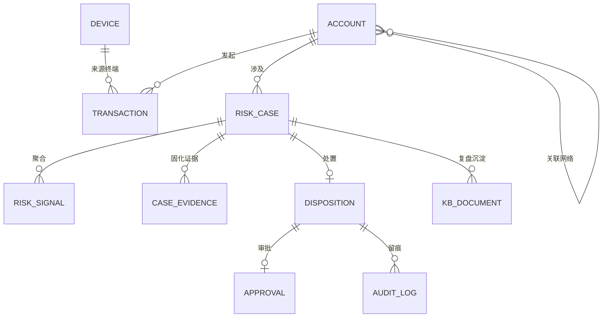
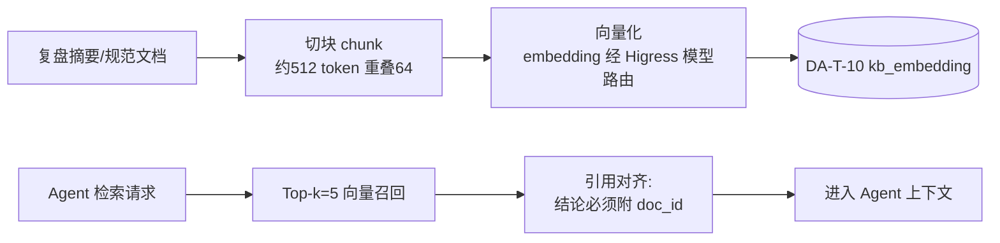

# 03 · 数据架构（DA）——语义模型、存储与 RAG 设计

> 本文档是 TradeGuard 的数据视角阐述：应用架构 [02 AA](./02-应用架构AA.md) 中 Agent 与 Skill 操作的数据对象在本文档定义。编号规范见 [00 总则 §3](./00-总则.md#3-引用编号规范跨文档溯源用)。

---

## 1. 数据域划分

| 数据域 | 内容 | 主要存储 | 特征 |
| --- | --- | --- | --- |
| 业务数据域 | 账户、交易、风险事件、处置记录 | PolarDB 行存（TA-C-03） | 强一致、事务 |
| 风险知识域 | 欺诈手法案例、监管规范、处置 Runbook | PolarDB + pgvector | 向量检索 |
| 协同状态域 | 事件共享状态、Agent 记忆、审批状态 | PolarDB + Matrix 房间历史 | 跨 Agent 共享 |
| 审计观测域 | 审计日志、Trace、Metrics | PolarDB append-only 表 + 可观测后端（TA-C-07） | 只增不改 |

---

## 2. 概念模型



---

## 3. UnifiedModel 语义模型

使用 UnifiedModel（TA-C-08）将分散在业务表中的实体与关系统一建模，供 AA-AG-03 的关联网络分析以语义查询替代多表 JOIN。

### 3.1 节点定义（Node）

| 编号 | 节点类型 | 关键属性 | 来源表 |
| --- | --- | --- | --- |
| DA-N-01 | 账户主体（Account） | account_hash、风险等级、名单标记 | DA-T-01 |
| DA-N-02 | 设备（Device） | device_fp_hash、首次/最近出现时间 | DA-T-02 派生 |
| DA-N-03 | 交易（Transaction） | tx_hash、金额、MCC、渠道、时间 | DA-T-02 |
| DA-N-04 | 风险事件（Case） | case_id、状态、风险分 | DA-T-03 |
| DA-N-05 | 收款账户（PayeeAccount） | payee_hash | DA-T-02 派生 |
| DA-N-06 | IP 段（IpRange） | ip_segment | DA-T-02 派生 |
| DA-N-07 | 联系方式（Contact） | contact_hash | DA-T-01 派生 |

### 3.2 关系定义（Link）——与 BA-BP-03 四类扩展边一致

| 编号 | 关系 | 含义 | 权重用途 |
| --- | --- | --- | --- |
| DA-L-01 | SAME_DEVICE | 两账户共用设备指纹 | 关联网络扩展边 |
| DA-L-02 | SAME_PAYEE | 两账户向同一收款账户转账 | 关联网络扩展边 |
| DA-L-03 | SAME_IPSEG | 同一 IP 段活跃 | 关联网络扩展边 |
| DA-L-04 | SAME_CONTACT | 预留联系方式相同 | 关联网络扩展边 |
| DA-L-05 | INITIATED | 账户发起交易 | 拓扑还原 |
| DA-L-06 | INVOLVED_IN | 账户涉及风险事件 | 拓扑还原 |

### 3.3 模型包与查询方式（示意）

模型包按 UModel 规范定义 Node/Link/存储映射（以下为目标语义示意，实际语法以 UnifiedModel 官方规范为准）：

```yaml
# tradeguard.umodel（示意）
nodes:
  - Account(account_hash, risk_level, list_flag)
  - Device(device_fp_hash)
  - Transaction(tx_hash, amount, mcc, channel)
links:
  - SAME_DEVICE(Account, Device)
  - SAME_PAYEE(Account, PayeeAccount)
  - SAME_IPSEG(Account, IpRange)
  - SAME_CONTACT(Account, Contact)
```

调查 Agent 的典型查询（经 AA-MCP-01 `query_related_graph` 封装）：

```
# 语义：以账户 A 为起点，沿四类欺诈关联边做 2 跳扩展
.topo: start=Account("A_HASH") via [SAME_DEVICE, SAME_PAYEE, SAME_IPSEG, SAME_CONTACT] hops<=2
```

**价值**：关联查询从跨表 JOIN 变为标准语义查询，且触发 BA-BR-06（2 跳内存在已确认欺诈主体则风险分 +30）时可直接返回证据路径。

---

## 4. PolarDB 逻辑模型

存储选型 PolarDB for PostgreSQL（TA-C-03），一库承载业务+向量+审计。核心表（字段为关键字段摘要）：

| 编号 | 表 | 关键字段 | 读写方 | 约束 |
| --- | --- | --- | --- | --- |
| DA-T-01 | account | account_hash PK, risk_level, list_flag(black/gray/watch), contact_hash | AA-AG-02/03 读，人工后台写；演示档合成数据发生器（SIM）写（含团伙打标 UPDATE） | 卡号/证件号不落明文 |
| DA-T-02 | transaction | tx_id PK, account_hash, amount, mcc, channel, device_fp_hash, ip, geo, ts | AA-AG-02 读；模拟交易发生器写 | 按 ts 分区 |
| DA-T-03 | risk_case | case_id PK, subject_ref, status(状态机), risk_score, current_agent, context_json, version(乐观锁), source_type(案件来源，自动环排除 TEST) | AA-AG-01 写；全体 Agent 读 | 状态流转经 RocketMQ 事件；并发写入用乐观锁（version）防覆盖 |
| DA-T-04 | risk_signal | signal_id PK, case_id FK, source(tx/credit/sentiment/complaint), type, confidence, raw_ref, query_reason, velocity_json | AA-AG-02 写 | 查询事由必填（BA-BR-10）；velocity_json 存频次统计特征（BA-BR-14） |
| DA-T-05 | case_evidence | evidence_id PK, case_id FK, claim, source_ref, confidence | AA-AG-03 写 | 证据不可删改 |
| DA-T-06 | disposition_record | exec_id PK, case_id FK, action(block/freeze/reduce/release), amount, idempotency_key UQ, approval_ref, status | AA-AG-04 写 | 幂等键唯一约束 |
| DA-T-07 | approval_record | approval_id PK, case_id FK, approver, decision, opinion, ts | AA-AG-04 创建工单（decision 置空）；人类审批官回填 decision | 回填后不可变更（DA-INV） |
| DA-T-08 | audit_log | log_id PK, actor(agent/人), action, target, basis, trace_id, ts | 全链路写 | **append-only**（BA-BR-09） |
| DA-T-09 | kb_document | doc_id PK, category(case/regulation/runbook/rule_proposal), title, content, status(pending/published), source_case_id | AA-AG-05 申请写，人工发布 | 发布须人工（BA-BR-11）；source_case_id 记录提案触发案件（LoopEngine 慢环归因链接） |
| DA-T-10 | kb_embedding | doc_id FK, chunk_id, embedding vector(1024), text | 入库流水线写 | pgvector HNSW 索引 |
| DA-T-11 | sys_config | key PK, value, version, source(nacos) | Nacos 镜像落盘 | 阈值规则快照（BA-BR-01 等） |
| DA-T-12 | agent_memory | memory_id PK, agent_id, case_id, summary, ts | 各 Agent 写 | Agent 长期记忆（能力项之一）；**写时机**：各 Agent 阶段结束时写执行摘要；**读时机**：AA-SK-02 根因匹配与 AA-SK-05 复盘时检索同主体同类记忆作辅助上下文 |
| DA-T-13 | case_state_transition | from_status, to_status, 白名单约束（治理辅助表） | 状态机迁移写 | 数据库触发器白名单，绕过应用的直连写入同样被拒绝（字典见 [08](./08-数据模型与数据字典.md) §3 DA-T-13） |
| DA-T-14 | account_baseline | account_id PK, window(30d), ewma_amount, p95_amount, hour_histogram, updated_at | 聚合阶段 upsert 维护 | 自适应基线（BA-BR-15）；缺失回退全局阈值（见 [14](./14-增强路线图多层分拆-4A到敏捷排期.md) A1） |
| DA-T-15 | disposition_outcome | case_id PK, t7_label, t30_label, recidivism_flag, appealed_flag | 定时任务 T+7/T+30 回填 | 处置效果长窗跟进（C2）；跨聚合仅以 case_id 引用 |
| DA-T-16 | processing_deadletter | case_id PK, stage, error_class/error_msg, attempts, parked, resolved_by/resolved_at | EventWorker 环写，人工经 /api/deadletter 复位 | LoopEngine 失败归宿（DLQ）：累计达上限驻车停扫，复位只增不删；不改案件状态（状态机仍是迁移权威） |
| DA-T-17 | proposal_attribution | doc_id PK FK→kb_document, source_case_id, subject_ref, published_at, recurred_after, checked_at | 代谢巡检任务写 | rule_proposal 发布后效果归因（慢环可度量，KPI-08 载体）；只增不重算 |

**索引要点**：transaction 按 ts 分区 + account_hash 索引；risk_signal 按 case_id 索引；kb_embedding 建 pgvector HNSW 索引。

**权限边界**：每个 Agent 对应独立数据库账号，按 §6 矩阵授予最小权限；审计表账号均无 UPDATE/DELETE。

---

## 5. RAG 知识库设计

### 5.1 知识库集合

| 编号 | 集合 | 内容 | 消费方 |
| --- | --- | --- | --- |
| DA-KB-01 | 欺诈手法案例库 | 历史确诈事件复盘、手法特征（测卡/ATO/跑分）、判定要点 | AA-SK-02 根因假设匹配 |
| DA-KB-02 | 监管规范与内部制度库 | 处置合规要求、审计检查清单 | AA-SK-04 审计报告生成 |

### 5.2 RAG 流水线



设计约束（RAG 作为上下文能力而非独立组件）：

1. MCP 接入数据源（AA-MCP-01 `submit_kb_application`）、Skill 封装检索与证据对齐（AA-SK-02/05）、Agent 判断检索结果是否足以支撑决策——严格遵循 RAG 作为上下文能力的定位；
2. 检索结果必须携带 doc_id 引用，写入 DA-T-05 证据表，保证结论可回溯；
3. 未匹配到知识库时 Agent 必须显式声明"无先例依据"，禁止凭空生成手法结论（防幻觉硬约束）。

### 5.3 Agent 能力项落实清单

| 能力项 | 是否实现 | 落点 |
| --- | --- | --- |
| Agent 记忆存储 | ✅ | DA-T-12 agent_memory |
| 知识库 RAG | ✅ | DA-KB-01/02 + 本节流水线 |
| 共享状态管理 | ✅ | DA-T-03 context_json + Matrix 房间 |
| 轨迹可观测 | ✅ | TA-C-07 Trace（见 04 §7） |

四项全实现，超出"至少 2 项"要求。

---

## 6. Agent 数据读写矩阵

| 数据对象 | AG-01 主控 | AG-02 聚合 | AG-03 调查 | AG-04 处置 | AG-05 审计 | 人类 |
| --- | --- | --- | --- | --- | --- | --- |
| DA-T-01 account | 读 | 读 | 读 | — | 读 | 写 |
| DA-T-02 transaction | — | 读 | 读 | — | 读 | — |
| DA-T-03 risk_case | 读写 | 读 | 读 | 读 | 读 | 读 |
| DA-T-04 risk_signal | 读 | 写 | 读 | — | 读 | — |
| DA-T-05 case_evidence | 读 | — | 写 | 读 | 读 | — |
| DA-T-06 disposition_record | 读 | — | — | 写 | 读 | — |
| DA-T-07 approval_record | 读 | — | — | 创建工单 | 读 | 回填决策 |
| DA-T-08 audit_log | 写 | 写 | 写 | 写 | 写 | 写 |
| DA-T-09/10 知识库 | — | — | 读 | — | 申请写 | 发布写 |
| DA-T-12 agent_memory | 读写 | 读写 | 读写 | 读写 | 读写 | — |

原则：**写权限最小化、单向化**——调查 Agent 无处置写权限，处置 Agent 无定性写权限，知识库发布权只在人类。

---

## 7. 数据安全与生命周期

1. **脱敏**：卡号存后四位+SHA-256 哈希；证件号仅哈希；姓名不出库；
2. **查询留痕**：个人信息查询必须携带事由（BA-BR-10），事由写入 DA-T-04/DA-T-08；
3. **保留策略**：事件与交易数据 5 年，超期脱敏归档（BA-BR-12）；审计日志与 Trace 保留 3 年。执行脚本：`scripts/data_retention.py`（默认 dry-run 出计划，`--execute` 落库：transaction 整月过期分区脱敏拷入 transaction_archive 后 DROP、散行脱敏 DELETE；risk_case ARCHIVED 超期行原地脱敏，审计链骨架不破坏）；
4. **合成数据**：演示环境全部使用合成数据生成器产出的模拟数据（见 04 §8），不含真实个人信息。

---

## 8. 向下游架构的交接声明

- 全部表与向量索引由 PolarDB for PostgreSQL 承载（TA-C-03）；
- 语义模型由 UnifiedModel 承载（TA-C-08），其存储后端指向本文档 DA-T 表；
- 事件状态流转事件经 RocketMQ（TA-C-06），消息体 Schema 以 DA-T-03 字段为准；
- 配置快照 DA-T-11 由 Nacos（TA-C-05）下发镜像，用于审计追溯。

---

## 9. DDD 战术设计（聚合、领域事件与不变量）

战略层面的限界上下文见 [01 §10](./01-业务架构BA.md#10-ddd-战略设计限界上下文与上下文映射)；本节定义各上下文内部的战术构件，是实现代码结构与 BDD 场景（[06](./06-BDD-TDD工程验证体系.md)）的设计依据。

### 9.1 聚合设计

| 聚合根 | 成员实体/值对象 | 所属上下文 | 一致性边界 |
| --- | --- | --- | --- |
| **RiskCase 风险事件**（DA-T-03） | RiskSignal 集合（DA-T-04，只增）、风险分值对象、状态机值对象、context_json 共享状态 | 风险事件 | 风险分与状态变更必须与信号集合同事务；信号只增不改 |
| **EvidenceChain 证据链**（DA-T-05） | Evidence 实体（claim/source_ref/confidence 值对象） | 欺诈调查 | 证据只增不删改；冻结结论必须附非空证据链 |
| **Disposition 处置**（DA-T-06） | 幂等键值对象、审批凭证引用、执行状态值对象 | 风控处置 | 幂等键全局唯一；高风险处置无 approval_ref 不可执行 |
| **Approval 审批**（DA-T-07） | 审批意见值对象 | 风控处置 | 批准/驳回后不可变更，只能新增记录 |
| **KbDocument 知识文档**（DA-T-09） | Chunk 集合（DA-T-10）、发布状态值对象 | 风控知识 | pending→published 仅人工可触发 |

跨聚合引用一律用 ID（如 Disposition.case_id、Disposition.approval_ref），不持有对象引用；跨聚合一致性由领域事件最终一致保障（§9.2）。

### 9.2 领域事件目录

统一经事件发布器流转（进程内 SSE 总线 + RocketMQ Topic `case-events` 尽力而为，04 §10.1），Tag 即事件类型（与 TA-C-06 对齐）；消息体为扁平信封 `case_id / trace_id / occurred_at / event / actor / payload`。人类操作类事件（Approval*/Review*）由 web-api（04 §10.1）代人类发布，actor 字段记录真实操作人（human:* 前缀）。

| 事件 | 发布方 | 订阅方 | 触发动作 |
| --- | --- | --- | --- |
| CaseRegistered | web-api 立案（API-W-01） | EventWorker（自动承接，AA-CL-01/02） | 启动 BA-BP-02 聚合 |
| SignalsAggregated | 信号聚合内核 | 主控/门户 | 风险分级裁决 |
| InvestigationRequested | 主控 | 调查取证内核 | 启动 BA-BP-03 |
| InvestigationCompleted | 调查取证内核 | 处置执行内核、审批门户 | 生成处置建议/发起审批 |
| ApprovalApproved / ApprovalRejected | 人类审批官（web-api 代发） | 处置执行内核 | 执行或驳回回滚（BA-BR-07） |
| DispositionExecuted | 处置执行内核 | 合规审计内核 | 启动核验（BA-BR-08 计时） |
| DispositionFailed | 处置执行内核 | 人工通道 | 重试耗尽/准入拒绝 → MANUAL_REVIEW |
| VerificationPassed / VerificationFailed | 合规审计内核 | 主控 Agent、值班房间 | 结案或反向处置 |
| RollbackExecuted / RollbackEscalated | 合规审计内核 | 人工通道 | 反向处置完成→P0 转人工 / 反向未执行→直接升级转人工 |
| CaseArchived | 主控 Agent | 审计 Agent（知识沉淀任务） | 启动 BA-BP-04 |

> **事件分类声明（Sprint 8 按实现修订）**：事件名共 26 个，与 openapi SseEvent 枚举逐字一致——①立案事件 CaseRegistered；②状态机迁移事件 18 个（含 Sprint 0 曾声明"不投递 Topic"的 AggregationStarted/NoiseDismissed/DispositionSubmitted/RollbackToReview/RollbackExecuted/ReviewConfirmed/ReviewDismissed，现一律经 repositories.transition 发布，payload 统一 `{from,to}`；新增 DispositionFailed 失败出口与 RollbackEscalated 拆事件，迁移总数 21）；③计时器事件 2 个：ApprovalEscalated（BA-BR-13）、VerificationOverdue（BA-BR-08）；④领域扩展事件 4 个（[14](./14-增强路线图多层分拆-4A到敏捷排期.md)）：E-INV-HYPOTHESIS（并行假设生成）/ E-REVIEW-DEBATE（控辩互审）/ E-KB-DECAY（知识降级）/ E-OUTCOME-FOLLOW（T+7/30 回填）；⑤环设施事件 1 个：E-WORKER-DLQ（LoopEngine：聚合环重试累计达 DLQ 上限驻车告知，可见性入口 /api/deadletter，不驱动状态迁移）。**trace_id 来源**：立案时生成并落 risk_case.trace_id，此后所有事件发布从案件记录透传（缺失回落 uuid），跨技能 span 与审计链同源关联。投递语义：进程内 SSE 总线必达（API-W-14 展示面），RocketMQ 为尽力而为（发布失败降级不断链，04 §10.1 如实声明）。

### 9.3 聚合不变量（Invariants，代码与测试必须守护）

| 编号 | 不变量 | 来源规则 | 验证方式 |
| --- | --- | --- | --- |
| DA-INV-01 | RiskCase 状态流转仅允许状态机定义的迁移路径 | 02 §7 状态机 | 状态机单元测试（06 §3） |
| DA-INV-02 | 风险分 ≥70 的事件不得进入自动处置通道 | BA-BR-02 | BDD SC-02 |
| DA-INV-03 | Disposition 幂等键重复提交必须返回首次执行结果 | AA-SK-03 | BDD SC-07 |
| DA-INV-04 | 冻结动作的证据链为空时拒绝写入 | BA-BR-03 | 单元测试 |
| DA-INV-05 | audit_log 任何账号无 UPDATE/DELETE 权限 | BA-BR-09 | 集成测试（权限验证） |
| DA-INV-06 | 知识文档状态不经人工操作不得变为 published | BA-BR-11 | BDD SC-05 |
| DA-INV-07 | topology_stats 与 LLM 建议分不得直接驱动状态迁移（裁决仅规则内核 + 人工审批） | BA-BR-16 | 单元（状态机白名单）+ 契约 + BDD SC-13 |
| DA-INV-08 | rule_proposal 条目未经 human 审核不得进入规则库 | BA-BR-21 | DB 触发器 + 集成 + BDD SC-17 |
| DA-INV-09 | debate_json 与审计摘要只增不改（延伸 DA-INV-05 语义） | BA-BR-19 | 权限矩阵测试 + BDD SC-16 |

### 9.4 战术设计向工程的交接

- 聚合边界即代码模块边界（仓库按上下文分包）；
- 每个不变量对应至少一个自动化测试（映射见 [06 §4](./06-BDD-TDD工程验证体系.md#4-场景规则测试追溯矩阵)）；
- 领域事件 Schema 变更必须先改本节目录再改代码。
