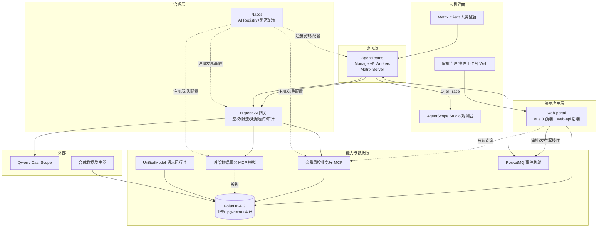

# 04 · 技术架构（TA）——技术选型、部署与治理

> 本文档是 TradeGuard 的技术视角阐述：[02 AA](./02-应用架构AA.md) 的应用构件与 [03 DA](./03-数据架构DA.md) 的数据对象在本文档落到具体技术组件与部署形态。编号规范见 [00 总则 §3](./00-总则.md#3-引用编号规范跨文档溯源用)。

---

## 1. 选型总原则

1. **核心基座无条件采用**：AgentTeams（架构基点）；
2. **推荐项按必要性取用**，每项给出"为什么用它 + 不用它行不行 + 替换成本"（选型原则：重点不在堆叠工具，而在必要性、可替换性、权限边界、闭环证据）；
3. **版本不冒进**：只锁大版本线，全部为经生产验证的稳定线（执行 [00 §4 版本策略](./00-总则.md#4-技术版本策略保守原则)）；
4. **每个组件均有社区成熟度依据**，见 §2 选型表。

---

## 2. 技术选型总表

| 编号 | 组件 | 定位 | 版本策略 | 社区成熟度依据 | 必要性 | 等价替代与迁移成本 |
| --- | --- | --- | --- | --- | --- | --- |
| TA-C-01 | **AgentTeams（原 HiClaw）** | 多 Agent 协同底座（核心基座） | 官方 Quick Install 当前稳定版 | 阿里云开源，Matrix 协议生态，GitHub alibaba/hiclaw | 架构基点 | 无替代（基点约束） |
| TA-C-02 | Skill 体系 + 云 Skills 门户 | Agent 能力抽象层（核心组件） | 随 TA-C-01 | skills.aliyun.com 官方门户 | 架构基点 | — |
| TA-C-03 | PolarDB for PostgreSQL（含 pgvector） | 业务/向量/审计一体化存储 | 兼容 PostgreSQL 14+ 的稳定版；pgvector 取与内核兼容的稳定版 | openpolardb.com 开源，pgvector 为主流向量扩展 | 一库承载 DA 全部表，降低运维面 | 换标准 PostgreSQL+pgvector：仅改连接串与部署编排，Schema 不变 |
| TA-C-04 | Higress | AI 网关：模型/MCP/外部 API 统一入口、鉴权、限流、凭据透传 | 最新稳定版 | 阿里开源，遵循 Ingress/Gateway API 标准，生产广泛 | HiClaw 架构自带安全治理层；BA-BR-09 审计入口 | 换任意 Gateway API 兼容网关：改路由配置，上游调用不变 |
| TA-C-05 | Nacos 3.2.x | AI Registry：MCP/Skill/Prompt 注册 + 阈值动态配置 | 3.2.x 稳定线（不使用预览版特性） | 阿里开源 10 年生产验证；3.2 起官方提供 AI Registry 与 Skills Registry | BA-BR-01 等阈值热更新；MCP/Skill 治理 | 配置可退化为静态文件+重启：丢失热更新能力，接口不变 |
| TA-C-06 | Apache RocketMQ 5.x | 事件驱动：风险事件状态机流转、可靠通知 | 5.x 稳定线 | Apache 顶级项目，金融级广泛使用 | AA-CL-01/02 异步解耦与可靠投递 | 换其他 MQ：Topic/Tag 映射迁移约 1 人日 |
| TA-C-07 | AgentScope Studio（可观测） | Trace 可视化 + 评估统计 | npm @agentscope/studio 稳定版（Node ≥20） | agentscope-ai 官方开源，OpenTelemetry 原生 | 可观测 + 离线评估 | 换 LoongSuite/AgentLoop：仅改 exporter 上报端点 |
| TA-C-08 | UnifiedModel | 实体-关系语义层，关联网络分析 | 最新稳定版 | 阿里开源，厂商中立语义运行时 | BA-BP-03 关联网络以语义查询替代多表 JOIN | 退化为 SQL 视图+JOIN：功能等价，查询代码改造约 2 人日 |
| TA-C-09 | LLM 与 Embedding | Qwen 系列经 DashScope 接入（走 TA-C-04 路由） | 商用稳定版 | 通义千问商用服务 | Agent 推理与向量化 | 换任意 OpenAI 兼容模型服务：改网关路由与模型名 |
| TA-C-10 | Docker / Docker Compose | 本地与演示环境编排 | 稳定版 | 事实标准 | 一键拉起全栈 | — |

---

## 3. 部署拓扑



部署形态与资源估算（工程交付物）：

- **AgentTeams 单独部署**：按官方 Quick Install 脚本安装（非 compose 服务），其余组件由 docker compose 编排：`higress`、`nacos`、`postgres`（PolarDB-PG 本地等价）、`rocketmq-namesrv/broker`、`mcp-core`、`mcp-external-mock`、`as-studio`、`web-portal`（前端静态资源）与 `web-api`（FastAPI 后端，拆分为两容器，职责隔离便于独立伸缩与镜像复用）、`data-generator`（tools profile 按需运行），两者经同一 Docker 网络互通；一键 `docker compose up -d` + 官方安装脚本两步完成；UnifiedModel 语义运行时在 Sprint 0 走 SQL 视图退化路径（`db/init/03-umodel-fallback.sql`，见 TA-C-08 替换成本列），接入正式运行时仅换 mcp-core 查询后端；
- **资源估算**：JVM 组件（RocketMQ broker、Nacos）+ PolarDB + Higress + AgentTeams 合计内存需求约 10–12 GB，**演示环境最低 8C16G**；4C8G 仅支持裁剪部署（去掉 UnifiedModel 与 Studio，走退化路径，见 §2 替换成本列）；
- **服务依赖顺序**：compose 中以 healthcheck + depends_on(condition: service_healthy) 保证 postgres / rocketmq 就绪后再启动 mcp-core 与 agent 侧服务。
- **Sprint 0 部署实测备注（Windows/Docker Desktop）**：apache/rocketmq:5.3.1 外挂 `-c` broker.conf 触发 ScheduleMessageService NPE（rocketmq-docker#85），且镜像内无 store 目录导致空卷属主冲突，故本地编排不挂配置与 store 卷，Topic 用 mqadmin 预建（scripts/rocketmq-init.md）；Nacos v3 镜像强制要求 AUTH_TOKEN，探活端点改用控制台根路径；生产 Linux 环境可恢复卷挂载与 v1 readiness 探活。

---

## 4. AgentTeams 集成设计（TA-C-01）

1. **安装**：官方 Quick Install 脚本一键部署（Docker 前提），Manager 控制台即运维入口；
2. **Worker 创建**：按 [02 §3](./02-应用架构AA.md#3-agent-identity-清单标准字段全量) Identity 清单创建 5 个 Worker，身份 Prompt 中写入职能边界、可用 Skill、安全约束；
3. **房间策略**：每个风险事件开一个 Matrix 房间，Manager 与各阶段 Worker 入群；房间消息即 AA-CL-03 上下文传递载体，房间归档即证据沉淀（AA-CL-06）；
4. **人类监督**：审批官/值班员随时进房观察发言（"审批与回滚"的人机通道）；
5. **凭据安全**：Worker 仅持 consumer token，外部密钥由 Higress 凭据透传，被攻破的 Worker 不泄露凭据（HiClaw 官方安全模型）。

**协同映射声明（五维协同 → 框架能力，2026-08-14 实测落地）**：本方案以 AgentTeams 为多 Agent 协同设计基点，角色编排、任务拆解、上下文传递、协同执行、状态追踪逐一映射到框架能力。逐项映射与实测证据如下（均为独立部署栈的真实运行态，非纸面设计）：

| 协同维度 | AgentTeams 框架能力 | TradeGuard 落地 | 实测证据 |
| --- | --- | --- | --- |
| **角色编排** | Manager Agent（controller CRD 管理）+ Worker Agent；Worker 身份经 SOUL.md 注入 | Manager=default 即 AA-AG-01 风控主控；4 Worker `aa-ag-02~05` 对应 [02 §3](./02-应用架构AA.md#3-agent-identity-清单标准字段全量) Identity 清单（信号聚合/调查取证/处置执行/合规审计）；`agt create worker --model qwen3.8-max --soul-file` 创建，SOUL.md 写入职能边界/可用 Skill/安全约束 | `agt get managers/workers` 全部 Running（model=qwen3.8-max，runtime=copaw）；Worker 容器内 SOUL.md 逐字核对与 Identity 清单一致（AA-AG-02 SOUL 含 AA-SK-01 + AA-MCP-01/02 + BA-BR-10 边界） |
| **任务拆解** | Manager 拆解分派 + Worker task-management 技能/任务文件协议（coordinator 模型） | AA-AG-01 接告警（RocketMQ case-events）后拆解为 聚合→调查→处置→审计 子任务，经 Matrix 房间分派；Worker 以任务文件为唯一事实源、结构化提交结果（AGENTS.md 内置任务协议，NO_REPLY/完成/阻塞语义） | Worker 容器 AGENTS.md 含完整任务执行工作流；每 Worker 有独立 Matrix RoomID 承接分派 |
| **上下文传递** | Matrix 房间消息 + file-sharing 共享文件系统（MinIO） | 每风险事件一个 Matrix 房间，Manager 与各阶段 Worker 入群，房间消息=AA-CL-03 上下文载体；跨 Agent 共享状态经 DA-T-03 risk_case + 扁平事件信封 `{case_id, trace_id, occurred_at, event, actor, payload}`；产物经 file-sharing 技能推送 | Worker 有 MatrixUserID + RoomID；agentteams-fs 共享目录在场 |
| **协同执行** | Worker 经内置 Skill + MCP 工具桥（mcporter）执行，支持多案件并行 | 4 Worker 并行处理多案件；Worker 经 mcporter 工具桥调用 TradeGuard 两个 MCP Server（tg-core=业务库 12 工具 / tg-external=外部源 3 工具，均 streamable-http），AA-SK 技能经此落到真实工具 | 4 Worker `mcporter list` 均 healthy（tg-core 12 + tg-external 3）；Worker aa-ag-02 实调 `tg-core.query_transactions` 返回真实库内交易行（端到端 Worker→MCP→业务库打通） |
| **状态追踪** | RocketMQ 状态事件 + 房间历史 + AgentTeams 控制台 | 案件状态机（12 态/19 事件/22 迁移）经 RocketMQ case-events 流转（TA-C-06）；房间历史 + DA-T-08 append-only 审计双留痕；技能 span 经 OTLP 上报 Studio 按案件分组；Manager 控制台/dashboard 运维观测 | demo_playbook 3/3（24 步校验）；Studio span_table 按案件分组落库；dashboard 容器常驻 |

> **集成深度如实声明（2026-08-14）**：AgentTeams 为独立部署栈（官方脚本，非 compose 服务），controller/Manager/4 Worker 已全量拉起并接入 tradeguard-net，MCP 工具桥已注入全部 Worker 并实测调用成功。演示场景（demo_playbook）采用与 Worker 同源的确定性技能内核（`services/web-api/app/skills/`）追溯，保证"演示=测试追溯"可复现；AgentTeams 层提供真实编排运行时（Manager 分派 + Worker 执行 + Matrix 协同），两套路径共用同一状态机/MCP/审计底座，无分叉实现。运维复原因 Worker sleep/wake 重建容器会丢手工组网与容器层 mcporter 配置，已固化 `scripts/agentteams_doctor.py` 幂等体检恢复（拉起 controller→唤醒 Worker→接入 tradeguard-net→注入 MCP 桥→校验 12+3 工具在场）。

**自定义 Skill 装载路径与降级声明**：自定义 Skill 经 Nacos Skills Registry 注册后在 Worker 创建时声明装载；若 AgentTeams 当前版本对自定义 Skill 装载能力有限，降级路径为将 Skill 逻辑内置于 Worker 可用工具集（MCP 工具 + Prompt 级能力声明），Skill 清单与 9 属性定义不变（与 [05 §3.4](./05-追溯矩阵与整体评审报告.md) 残余风险第 2 项一致，实现阶段实测后定稿）。**当前实况**：5 个业务 Skill（AA-SK-01~05）以内核实现 + MCP 工具形态供 Worker 调用（即上述降级形态的稳定版），经 mcporter 工具桥发现与调用，已在 4 Worker 实测可用。

### 4.1 云 Skills 门户使用设计（TA-C-02：鉴权/编排/端到端体验）

| 维度 | 设计 |
| --- | --- |
| 使用范围 | 基础设施运维类能力（资源查询/监控告警/日志分析类官方用云 Skill）供主控 Agent 在环境巡检与故障定位时调用；5 个业务 Skill（AA-SK-01~05）为自研，经 Nacos Skills Registry 管理，两类 Skill 目录并存 |
| 鉴权 | 复用 Higress 凭据透传模型：云 API 真实凭据仅存网关，Agent 侧零密钥（与 TA-C-04 一致）；官方 Skill 所需 RAM/账号权限按最小化申请 |
| 编排 | 运维类 Skill 仅由主控 Agent 只读调用，不进入处置状态机（处置类动作一律走 AA-SK-03），避免编排面扩大攻击面 |
| 端到端体验应对 | 官方 Skill 依赖真实云账号；演示环境无云资源时降级为只读探活类 Skill 演示 + 文档声明替换路径（与 AA-MCP-02 模拟策略同级） |

---

## 5. Higress 网关治理策略（TA-C-04）

| 治理项 | 策略 |
| --- | --- |
| 统一入口 | LLM 调用、MCP 调用、外部 API 全部经网关，无旁路（部署拓扑中 MCP1/MCP2 均位于 Higress 下游） |
| 鉴权 | Worker consumer token 校验 + 路由级权限白名单（每个 Worker 只能访问其 Skill 声明的工具） |
| 凭据透传 | DashScope API Key 等真实凭据仅存网关，Agent 侧零密钥 |
| 限流 | 按 Worker 维度令牌桶限流，防止单 Agent 失控刷量 |
| 审计 | 全量访问日志含 trace_id，回流 DA-T-08 |
| 脱敏 | 响应过滤插件拦截卡号/证件号明文外发 |

> **落地实况（2026-08-14 实测，已接通）**：上表为生产形态治理设计全集（鉴权/限流/凭据透传/脱敏插件为生产形态能力，演示环境未逐一开启）；**演示环境门户业务流量已真实经过网关**，取证如下：
>
> 1. **流量路径**：浏览器→`localhost:8300`（web-portal nginx）→`higress:8080`（网关数据面）→`web-api.dns:8000`→web-api 容器。nginx 上游已由 `web-api:8000` 改指 `higress:8080`（web-portal/nginx.conf），页面全部 `/api` 业务请求与 SSE 实时推送均经网关转发（SSE 已验证网关不缓冲）；
> 2. **路由配置**：经 Higress standalone 文件仓（容器 /data）下发——McpBridge 将 web-api/mcp-core/mcp-external-mock 注册为 dns 型服务源（compose 为三服务配置 `*.tg.local` 网络别名，Docker 内嵌 DNS 解析；dns 型服务源要求带点域名），Ingress `/api`（Prefix）经 `higress.io/destination: web-api.dns:8000` 指向 web-api；
> 3. **端口修正**：all-in-one 2.2.3 数据面 HTTP 监听容器内 **8080**（`GATEWAY_HTTP_PORT` 缺省）、HTTPS 8443，容器内无 80 监听——compose 映射已由失效的 `8180:80` 修正为 `8180:8080`，宿主 `localhost:8180/api/health` 实测 200；
> 4. **实测证据**：envoy admin 集群计数 `cluster.outbound|8000||web-api.dns.upstream_rq_200` 随门户请求递增；经网关 `GET /api/cases` 返回真实库数据（分页 total/items），SSE `text/event-stream` 透传正常；
> 5. **可复现**：`docker compose down -v` 会清空网关配置卷（higress-data），`scripts/higress_routes.py` 幂等重建上述 McpBridge+Ingress 并重启网关验证（写入→restart→探活 :8180/api/health=200）；
> 6. **如实保留项**：控制台 UI（宿主 :8001）首次初始化流程（设管理员密码）尚未完成，控制台 REST API 仍 401——路由配置经文件仓下发而非控制台，不影响数据面承载流量。
>
> **承载范围的场景化取舍（不为用而用，避免孤岛）**：网关承载的是**门户演示流量**（演示的真实界面入口）；web-api→mcp-core/mcp-external-mock 的 Agent 内核调用通道保持直连，原因：处置执行是状态机关键路径（mcp-core 为唯一通道），若强制绕行网关会把处置可用性耦合到网关单点，且该链路为容器内东西向调用、无外部入口治理需求。三个 MCP 服务已全量注册为网关服务源（路由即开即用），生产形态按需为 MCP 调用加路由即可，应用代码零改动（入口无关性由 02 §3 端口适配层保障）。

---

## 6. Nacos AI Registry 治理设计（TA-C-05）

1. **MCP 注册中心**：AA-MCP-01/02 启动时注册元数据（工具清单、Schema、权限等级），Agent 从 Registry 发现工具——满足"治理设计和接口关系"设计要求；
2. **Skills Registry**：5 个核心 Skill 带版本号注册（防恶意/失控 Skill，官方 3.2 能力）；
3. **Prompt 管理**：各 Agent 身份 Prompt 模板集中管理、可灰度；
4. **动态配置**：BA-BR-01/02/05/06/08 阈值以 Config 管理，变更实时下发并镜像落 DA-T-11 供审计追溯；演示环节可现场热调阈值展示治理能力。

---

## 7. 可观测体系（TA-C-07）

**选型**：AgentScope Studio（主），保留 LoongSuite / 阿里云 AgentLoop 作为生产替换选项（迁移成本=改 exporter 上报端点，Trace 语义不变）。

| 维度 | 设计 |
| --- | --- |
| 数据采集 | 技能执行 span 由 `app/core/tracing.py::skill_span` 上下文管理器采集（AA-SK-01~05 全埋点）；语义遵循 OpenTelemetry（业界推荐标准），业务属性（case_id、agent_id、skill_id）写入 span attribute |
| 数据类型 | Trace（主）+ Log（审计联动）+ Metrics（时延/成功率/Token 消耗）——三类全覆盖，超出"至少 1-2 类"基线 |
| 上报通道 | 双通道：**① JSONL** 追加文件（`logs/traces.jsonl`，供 `/api/observability/traces` 追溯与 `scripts/kpi_report.py` 离线评估消费，跨重启留痕）；**② OTLP/HTTP 直推 Studio**（`TG_OTLP_ENDPOINT=http://as-studio:3000`，POST `/v1/traces`）——best-effort：上报失败仅降级 JSONL 单通道，观测面故障永不阻断处置面。案件编号 → traceId 取 md5 确定性映射（OTLP 要求 16 字节 hex），并写 `gen_ai.conversation.id`=case_id，Studio 内按案件分组会话、按业务属性检索 |
| 存储检索 | Studio 内置 SQLite（演示规模）；生产可导出 OTLP 至任意后端。注：Studio v1.0.9 的 OTLP 入口为混合字段语义（顶层 `resourceSpans` 为 camelCase、嵌套 span 字段与 attribute 值为 snake_case，标准全 camelCase OTLP JSON 会被静默丢弃），`_to_otlp()` 已按源码实证语义适配 |
| 评估应用 | 离线评估脚本基于 Trace 计算 BA-KPI-02/03/04（召回率、误报率、人工介入率）；BA-KPI-05（留痕完整率）由审计完整性校验任务按日对账：遍历 DA-T-06 全部处置记录，检查 DA-T-08 存在对应 actor/basis 完整记录的比例，形成"观测→评估→策略迭代"闭环 |
| 告警 | BA-BR-08 核验超时、Skill 失败率阈值经事件总线推送值班房间 |

---

## 8. 模拟数据与演示环境

1. **合成数据发生器**（data-generator 服务）：生成账户、交易流水（含正常/测卡/ATO/跑分四类模式）、模拟征信评分、舆情种子、客服投诉——演示数据集 5000 账户 / 10 万交易 / 其中欺诈团伙 5 组；采样参数借鉴社区基准 PaySim（交易类型分布、欺诈行为特征：快进快出、夜间集中、同设备多账户，见 [09](./09-社区对标分析.md)），不引入 GAN 类生成器；高频簇分布需支撑 SC-11 的 velocity 特征验证（BA-BR-14）；
2. **场景化演示**：预置 3 个演示事件（低风险自动放行、中风险调查后冻结+人工审批、误报申诉回滚），演示现场按场景触发；
3. **零真实数据承诺**：全部字段合成，符合 [03 §7](./03-数据架构DA.md#7-数据安全与生命周期) 合规要求。

---

## 9. 环境依赖与版本纪律

- 运行前提：Docker Desktop（8C16G+）、Node.js ≥20（仅 Studio 需要）；
- **备份与恢复**：演示环境提供 `backup.sh` 脚本（pg_dump + 目录快照，一键执行）；PolarDB 每日全量备份保留 7 份，审计表（DA-T-08）备份独立存放；恢复演练纳入实现阶段 DoD（06 §5 M3 后）；
- 所有镜像标签在交付提交时锁定具体稳定小版本并记录 CHANGELOG；
- 不启用任何组件的 Beta/实验特性；Nacos 预览版、PolarDB 预览特性一律不用。

---

## 10. 人机界面设计（web-portal，前端视角）

前端仅一个轻量服务 `web-portal`（演示规模，不做重前端），服务 BA §6 四类人类角色：

| 页面 | 服务对象 | 功能 | 数据来源 |
| --- | --- | --- | --- |
| 事件工作台 | 风控值班员 | 事件列表（状态/风险分/时效倒计时）、中风险人工复核队列、处置详情 | DA-T-03/06 |
| 审批门户 | 风控审批官 | 待审批队列（BA-BR-13 超时标红）、证据链展示、批准/驳回+意见；与 Matrix 房间双通道等价 | DA-T-07/05 |
| 审计查询 | 合规审计员 | 按 case_id 追溯完整审计链（SC-08 的界面载体） | DA-T-08 |
| 知识库后台 | 策略管理员 | 入库申请列表、确认发布/驳回（BA-BR-11 的人工把关界面） | DA-T-09 |

### 10.1 三端真实调用链（演示非写死 mock 的设计保证）

`web-portal`（Vue 3 前端静态资源，nginx 容器）与 `web-api`（Python FastAPI 后端容器，与 Agent 侧同一代码仓、同一套领域模型）**双容器拆分部署**（职责隔离/独立伸缩，见 §3 部署拓扑）。三端调用链均为真实链路：

```
浏览器(Vue 3) --HTTP--> web-api(FastAPI) --SQL--> PolarDB-PG（真实读写）
                              |
                              +-- 只读复杂查询：经 mcp-core 工具层（复用 query_audit_trail 等，与 Agent 同源同 Schema）
                              +-- 写操作：事务写 PolarDB 后发布领域事件（双通道，见下）
                              +-- 事件承接：EventWorker（DB 轮询主力 2s + RocketMQ 尽力而为）自动消费 CaseRegistered 推进聚合，闭环第一跳无人工
                              +-- 实时推送：进程内事件总线（必达）→ SSE 推送前端（事件流实时刷新）
```

**事件投递实况（A2 决策结果，2026-08-14 实测）**：web-api 安装 rocketmq-client-python 0.5.0rc2（该库唯一可用预编译线，cp312 manylinux wheel 实测可装），RocketMQ 发布器**真实连通** case-events Topic（topicStatus 四读写队列均有消息，rocketmq-init 一次性建 topic）；同时保留进程内事件总线作必达通道——SSE/API-W-14 从内存总线推送（MQ 发布失败仅降级日志，不断链）。消费侧主力为 EventWorker 的 DB 轮询（只捞 REGISTERED、单飞锁防重、失败静默跳过），MQ 消费为尽力而为补充。此即"事件驱动闭环"的落地语义：轮询保底 + MQ 加速，不依赖单一中间件可用性。

**web-api 接口清单**（实现基线）：

| 接口 | 方法 | 说明 | 对应页面 |
| --- | --- | --- | --- |
| `/api/cases` `/api/cases/{id}` | GET | 事件列表/详情，真实读 DA-T-03/04/05 | 事件工作台 |
| `/api/cases/{id}/review` | POST | 中风险人工复核结论（SC-10 载体），写 DA-T-03 + 审计 | 事件工作台 |
| `/api/approvals` `/api/approvals/{id}/decide` | GET/POST | 待审批列表；批准/驳回→回填 DA-T-07 + 发布 ApprovalApproved/Rejected 事件（02 §7 状态机的人类触发入口） | 审批门户 |
| `/api/audit/{case_id}` | GET | 审计链追溯，经 mcp-core `query_audit_trail`（SC-08 载体） | 审计查询 |
| `/api/kb/applications` `/api/kb/applications/{id}/publish` | GET/POST | 入库申请列表；发布→DA-T-09 状态置 published + 触发向量化（SC-05 载体，DA-INV-06 人工把关） | 知识库后台 |
| `/api/events/stream` | GET(SSE) | 订阅进程内事件总线实时推送（27 事件名，扁平信封，03 §9.2），演示时事件流转现场可见 | 全体页面 |
| `/api/cases/{id}/aggregate` `/investigate` `/verify` | POST | 流水线手动推进（API-W-17~19；自动承接由 EventWorker 完成，端点为兜底/演示控制面） | 事件工作台 |
| `/api/demo/subjects` `/api/cases/{id}/dispositions` | GET | 演示候选主体 / 处置凭证列表（API-W-21/22，场景与核验取证） | 事件工作台 |

**真实性的三条硬约束**：

1. 演示页面展示的所有数据均实时来自 PolarDB（由 data-generator 预置 + Agent 运行时产生），前端零内置静态数据；
2. 人类写操作（审批/复核/发布）全部真实落库 + 发事件 + 审计留痕，Agent 侧后续行为由事件真实驱动，无任何环节预编排；
3. 唯一的模拟是外部数据源（征信/舆情/投诉，AA-MCP-02）与合成数据集，属受控的数据源模拟，调用链路本身（HTTP→MCP→存储）与生产一致。

技术选型：Vue 3 + Element Plus（成熟社区、中文生态好，无版本冒进）+ FastAPI（与 Agent/Skill 同语言栈，复用领域模型与 Schema 校验）；写操作均经审计留痕（BA-BR-09）；web-api 对 PolarDB 使用独立账号，权限仅限页面所需表（执行 03 §6 矩阵的人类列）。不引入独立前端框架以外的重型中台。

---

## 11. 向上游架构的回接声明

- 本文档组件承载关系已在 [05 追溯矩阵](./05-追溯矩阵与整体评审报告.md) 与 BA/AA/DA 各编号交叉校验；
- 任何组件替换须同步更新：§2 选型表、[03 §8](./03-数据架构DA.md#8-向下游架构的交接声明) 承载声明、05 追溯矩阵。
